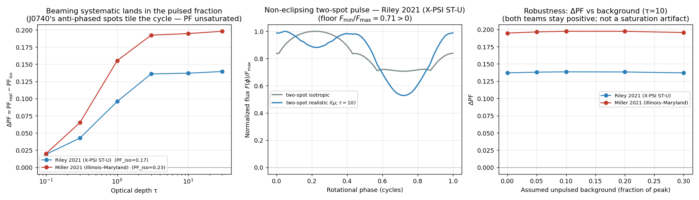
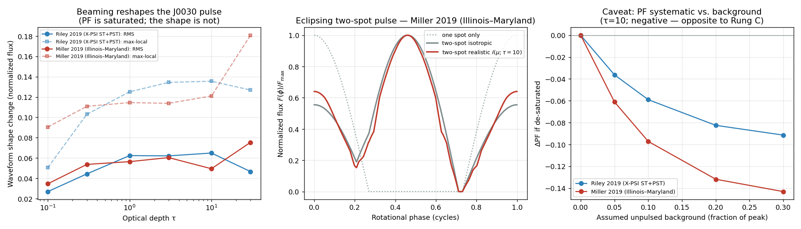
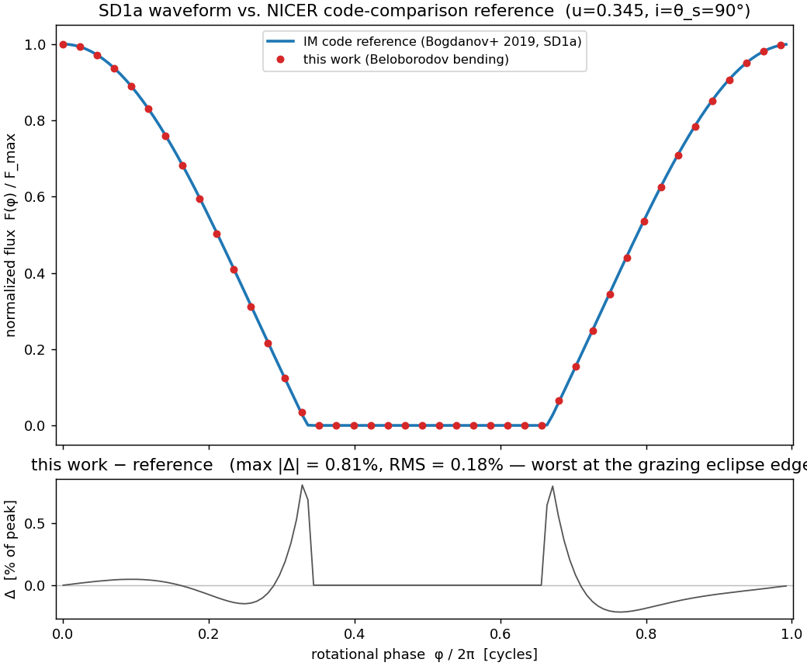
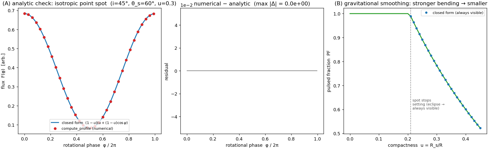
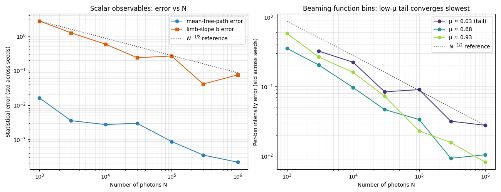
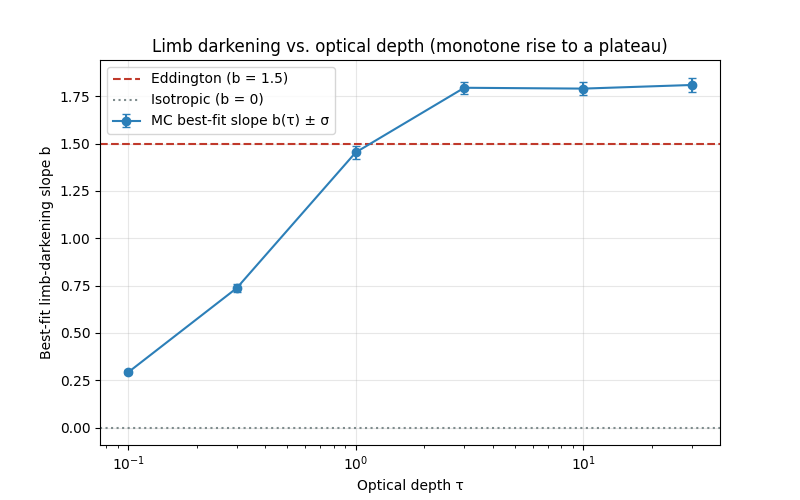

# Monte Carlo Radiative Transfer

We simulate X-ray photons bouncing through the thin layer of plasma that sits on top of a
neutron star. Each photon is followed one scatter at a time until it either escapes into space
or is reabsorbed by the surface. By recording the directions of the photons that escape, we
measure the star's **beaming function** `I(μ)` — how its brightness depends on viewing angle.
That beaming function is the input NASA's NICER telescope needs to turn a pulsing X-ray signal
into a measurement of a neutron star's mass and radius. Most models assume the surface glows
equally in all directions; this project tests how wrong that assumption is.

> **For the full math** behind every step, each progress-log entry links to a matching
> **deep dive** in [`docs/deep-dives/`](docs/deep-dives/) — plain-language, figure-by-figure
> derivations of that version's physics.

---

## Progress Log

*Newest first, tagged by version. Each entry has a one-line headline, why it matters, a figure,
and the technical details tucked underneath, plus a link to its deep dive. The 10-week project
plan in the [Timeline](#timeline) maps calendar weeks onto these versions.*

### v0.9.2 — At a second real star, the systematic lands in the pulsed fraction
*2026-06-24 · commit `474d470`*

**Anchored at PSR J0740+6620 — the non-eclipsing complement of J0030 — the beaming
systematic comes back to life in the pulsed fraction: ΔPF ≈ +0.16 (Riley 2021) to
+0.23 (Miller 2021) at τ ≈ 10. J0740's two hot spots are anti-phased and *tile* the
rotation, so the pulse never reaches zero, PF stays unsaturated, and the swap shows up
where NICER reads it. Both teams agree.**

v0.9.1 showed the systematic *hides* at J0030 because its same-hemisphere spots eclipse
and pin PF at 1. J0740 is the opposite geometry: viewed nearly edge-on (i ≈ 87.6°) but
extremely compact (u ≈ 0.494), so light bending keeps Riley's two spots (colatitudes
77°/108°, opposite hemispheres) visible *all* rotation — they only graze the limb
(μ_min ≈ 0.005), never set. Anti-phased ~half a cycle apart, they tile the cycle: the
two-spot pulse floor is `F_min/F_max ≈ 0.70`, so `PF_iso ≈ 0.18` — low and far from
saturation. The isotropic→realistic swap then raises PF directly, **ΔPF = +0.164 at
τ ≈ 10** (PF: 0.18 → 0.34), the same sign, size, and τ-shape as v0.9.0's invented
geometries — now on a published star, and PF-visible. Miller's independent fit places
the spots on the equator (≈ 92°), where each *center* dips behind for ~21% of the cycle
— yet anti-phasing keeps the combined pulse off zero (floor ≈ 0.63), so PF stays
unsaturated and ΔPF ≈ +0.23. The lesson v0.9.1 hinted at is now precise: what saturates
PF is not single-spot eclipse but whether the spots **tile** the rotation.



📐 **Full derivation:** [v0.9.2 — The Systematic Lands in the Pulsed Fraction](docs/deep-dives/v0.9.2-j0740-anchor.md)

<details>
<summary>Technical details</summary>

- **Geometry (from the papers' tables):** Riley 2021 ST-U — u = 0.494, i = 87.6°, two
  single-temperature circular caps at colatitude 77.3°/108.3°, ζ ≈ 0.147, log₁₀T ≈ 5.99,
  Δφ ≈ 0.442 (anti-phased). Miller 2021 two-circle — u = 0.444, i = 87.5°, spots at
  91.7°/92.4° (≈ equatorial), Δφ = 0.558.
- **Two-spot model, no core change:** light is additive, so the star's flux is the
  weighted sum of two `compute_profile` calls; the second spot's longitude is an
  `np.roll` phase shift. Weights ∝ area(sin²ζ) × T⁴ (near-equal caps). Mechanics now in
  the shared `scripts/anchor_lib.py`, from which the v0.9.1 J0030 script reproduces its
  numbers bit-for-bit.
- **Result:** Riley single-spot eclipse fraction 0% (μ_min ≈ 0.005), two-spot floor 0.70,
  PF_iso = 0.178, **ΔPF = +0.164 at τ ≈ 10** (PF_real = 0.342). Miller single-spot
  eclipse 21%, but two-spot floor 0.63, PF_iso = 0.227, ΔPF = +0.229. Positive throughout,
  peaking near τ ≈ 10 like `b(τ)`.
- **Robustness (not a caveat this time):** an assumed unpulsed background only dilutes the
  positive ΔPF (Riley +0.16 → +0.10, Miller +0.23 → +0.15 over 5–30%); it is not a
  saturation-edge artifact the way J0030's background panel was.
- **Candidate that didn't qualify:** PSR J0437−4715 (Choudhury 2024) eclipses (near-polar
  primary at Θ ≈ 8°), so J0740 is the non-eclipsing star.
- **Tests: 47/47 pass** (four new: single spot never eclipses, anti-phased spots tile and
  stay off zero, beaming raises PF, Miller's spots eclipse yet the sum does not saturate).
- Code: `scripts/j0740_anchor.py` → `data/pulse_profile_j0740.png`, `data/j0740_anchor.npz`.

</details>

**Next:** v1.0.0 — the paper. v0.9.0 (the systematic, ≈ +0.16 in PF), v0.9.1 (it hides in
shape when the geometry eclipses), and v0.9.2 (it lands in PF when the spots tile) are the
three rungs of one result.

---

### v0.9.1 — At a real star, the systematic hides in the waveform shape
*2026-06-10 · commit `<pending>`*

**Anchored at PSR J0030+0451's published geometry, the beaming systematic almost
vanishes from the pulsed fraction — and that is the point. J0030's spots eclipse, so
PF saturates; the systematic moves into the waveform *shape* (~6–8% RMS). Its
observability is geometry-dependent.**

v0.9.0 found ΔPF up to +0.16 on convenient always-visible geometries. Planting the
*same* swap at J0030 — the canonical NICER target, using both the Riley 2019 (X-PSI)
and Miller 2019 (Illinois–Maryland) fits — both teams place the hot spots in the same
far hemisphere, viewed nearly edge-on. The spots dive behind the star for ~45% of each
rotation, so the flux hits zero and the pulsed fraction pins at 1 for *both* beamings
(ΔPF ≈ 0). This is not a null: it is the extreme of v0.9.0's own "high-contrast" corner
(ΔPF only +0.018 there), where a saturated PF has no headroom. The beaming difference
doesn't disappear — it reshapes the visible waveform by ~6–8% RMS (growing with τ, like
the v0.9.0 effect). So the systematic is **PF-visible at intermediate geometries,
shape-visible at J0030** — geometry decides which measurement can catch it.



📐 **Full derivation:** [v0.9.1 — Anchoring the Systematic at a Real Star](docs/deep-dives/v0.9.1-j0030-anchor.md)

<details>
<summary>Technical details</summary>

- **Geometry (from the papers' tables):** Riley 2019 ST+PST — u = 0.312, i = 53.9°,
  spots at colatitude 127.8°/166.7°; Miller 2019 three-spot — u = 0.326, i = 50.3°,
  spots at 130.0°/138.5°. Both same-hemisphere, near edge-on.
- **Two-spot model, no core change:** light is additive, so the star's flux is the
  weighted sum of two `compute_profile` calls; the second spot's longitude is an
  `np.roll` phase shift (separations land on the 1024-point grid). Weights ∝ area × T⁴
  (Miller) or equal (Riley crescent; robustness-checked). The verified `mcrt.pulse`
  core is untouched.
- **Result:** single-spot eclipse fraction 45–46%; two-spot PF = 1.000 (saturated);
  waveform shape change RMS 0.065 (Riley)/0.075 (Miller), max-local 0.14–0.18.
- **Caveat (not modeled):** a common unpulsed background would lift the hard-zero floor
  and re-expose a PF systematic of −0.036…−0.143 (5–30% background) — *negative*,
  opposite to v0.9.0, because J0030's spots only reach μ ≲ 0.45 so limb darkening dims
  the peak instead of sharpening the contrast.
- **Tests: 43/43 pass** (four new: single-spot eclipse, two-spot saturation, shape-
  changes-while-PF-does-not, azimuth-roll mechanism).
- Code: `scripts/j0030_anchor.py` → `data/pulse_profile_j0030.png`, `data/j0030_anchor.npz`.

</details>

**Next:** v1.0.0 — the paper. v0.9.0 (the systematic, where PF sees it) and v0.9.1 (its
geometry-dependence, where it hides) are the two halves of one result.

---

### v0.9.0 — Scattering limb darkening sharpens the pulse
*2026-06-10 · commit `530eafc`*

**The first science result: swapping the textbook isotropic spot for our measured
scattering beaming `I(μ; τ)` — at the exact same geometry — raises the pulsed
fraction by up to ~16 percentage points. That is the systematic NICER would
misattribute if it assumed isotropy.**

Earlier work proved the geometry and light bending are correct, both using an
isotropic spot. This comparison holds that verified geometry fixed and changes only
the surface brightness: isotropic (`I ≡ 1`) vs. the realistic `I(μ; τ)` from the
beaming library. Because the surface is brighter face-on than at a graze, the
bright phase (spot facing us) is boosted more than the faint phase (spot at the
limb), so the pulse **sharpens** — `ΔPF = PF_real − PF_iso > 0` for every geometry,
growing with optical depth as the limb-darkening slope steepens (peaking near
τ≈10, easing at τ=30 just as the measured slope `b(τ)` does). The effect is largest
at intermediate geometries (ΔPF ≈ +0.16 at i=45°, θ_s=60°), where beaming has the
most leverage. This is also the real number that replaces the draft's fabricated
"∼15%".


📐 **Full derivation:** [v0.9.0 — The Beaming Systematic Becomes a Number](docs/deep-dives/v0.9.0-beaming-pulse.md)

<details>
<summary>Technical details</summary>

- **The swap:** `compute_profile(i, θ_s, u, beaming=beaming_lookup(mu_centers,
  intensity_by_tau[k]))` vs. the same call with `beaming=None`. Only the brightness
  term differs; a test asserts `cos α` and the visibility mask are bit-for-bit
  identical, so ΔPF is provably the beaming systematic, not a geometry artifact.
- **New helper:** `beaming_lookup` (in `mcrt.beaming`) — a pure, clamped 1-D linear
  interpolation of one τ row of the library; the noisy μ→0 tail is held flat rather
  than extrapolated. The `BeamingFunc` type now lives in `beaming` and is reused by
  `pulse`. No engine-physics change.
- **Result** (u ≈ 0.3445; M = 1.4 M⊙, R = 12 km): at τ=10, ΔPF = +0.065
  (i=20°/θ_s=20°), **+0.163** (45°/60°), +0.018 (60°/60°). Positive throughout,
  monotone-ish in τ with a peak at τ≈10 — it tracks the measured slope `b(τ)`.
- **Sign locked in a test:** the Eddington law (1 + 1.5μ), a monotone stand-in for
  the library, raises PF over isotropic — so the "sharpens" claim does not rest on
  the specific library numbers.
- **Scope:** monochromatic/bolometric, conservative Thomson, slow-rotation
  Schwarzschild — a *differential* result, which is why the verification steps had to pass first.
- **Code:** `scripts/beaming_pulse_sweep.py` → `data/pulse_profile_beaming.png`,
  `data/beaming_pulse_sweep.npz`; three new `tests/test_pulse.py` cases. Tests: 39/39 pass.
</details>

**Next:** the real-star anchor (v0.9.1) — anchor the swap at PSR J0030+0451's published
geometry and compare ΔPF to NICER's quoted uncertainty (differential, not a fit).

---

### v0.8.1 — Our waveform matches the NICER code comparison
*2026-06-09 · commit `46d88bb`*

**The pulse-profile machinery now reproduces a published NICER code-comparison
waveform to ~1% — independent confirmation that our geometry and light bending
agree with the exact ray-tracing codes the field uses, not just with our own
closed form.**

The analytic check tested the pipeline against a formula we derived ourselves; this
step checks it against someone else's *exact* code. We run the existing point-spot model at
the Bogdanov et al. (2019, "Paper II" / L26) **Test SD1a** geometry — a 1 Hz
(effectively non-rotating), isotropic, point-like spot, the one case in their
suite that needs no physics we defer — and compare to the Illinois–Maryland (IM)
reference profile. The match is max |Δ| = 0.8%, RMS 0.2%, with an identical
eclipse width; the only deviation sits at the grazing eclipse edge, which is the
known ~1% error of the Beloborodov bending approximation vs. exact ray-tracing.
No new module code — this is the v0.8.0 machinery evaluated at a community
benchmark.



📐 **Full derivation:** [v0.8.1 — Agreeing With the Community Codes](docs/deep-dives/v0.8.1-code-comparison.md)

<details>
<summary>Technical details</summary>

- **Benchmark:** Bogdanov et al. 2019 (ApJL 887 L26) Test SD1a — ν = 1 Hz, spot
  radius 0.01 rad (a point), isotropic Planck, i = θ_s = 90°, M = 1.4 M⊙,
  R = 12 km → u = 2GM/Rc² ≈ 0.3445. Reference waveform from the IM code.
- **Why SD1a:** at 1 Hz, v/c ≈ 2.5e-4, so Doppler / aberration / oblateness are
  negligible — the pure Schwarzschild light-bending limit our slow-rotation model
  targets. With isotropic emission the normalized shape is achromatic, so our
  bolometric curve compares directly to their monochromatic-at-1-keV curve.
- **Result:** visible fraction 0.6797 (ours) = 0.6797 (IM); max |Δ| = 0.81% at the
  eclipse edge; RMS = 0.18%; bulk profile to 0.01–0.05%. Eclipse 116.6° wide (vs
  180° flat) — bending shows ≈ 32° around the back. PF = 1 both (true eclipse).
- **Reference data is not committed** — third-party AAS supplementary material,
  gitignored; download + extract to `data/l26_reference/` to reproduce, and the
  test skips cleanly without it. Provenance / licensing:
  [docs/references.md](docs/references.md#reference-data-sets).
- **Code:** `scripts/code_comparison.py` → `data/pulse_profile_code_comparison.png`; new
  `test_sd1a_*` in `tests/test_pulse.py`. Tests: 36/36 pass.
</details>

**Next:** the isotropic-vs-realistic comparison (v0.9.0) — swap in the scattering beaming
`I(μ; τ)` at fixed geometry for the headline ΔPF result.

---

### v0.8.0 — A spinning hot spot becomes a pulse profile
*2026-06-08 · commit `9dfe74f`*

**The beaming function now drives an actual observable: brightness vs. rotation phase for a hot
spot on a spinning neutron star. The geometry, gravitational light bending, and integration are
verified bug-free against a closed form (the analytic check) before any new physics is allowed to
carry meaning.**

A new deterministic module turns the three ingredients of a pulse profile — viewing geometry,
Beloborodov light bending, and the surface beaming `I(μ)` — into the observed flux `F(φ)` and its
**pulsed fraction**. The verify-then-measure sequence starts here: with an *isotropic* spot the flux reduces
to a closed form, so the numerical pipeline must reproduce it exactly. It does, to machine
precision, for both an always-visible geometry and one where the spot sets behind the star yet is
partly visible "around the back" via bending. The physics shows through cleanly: as compactness `u`
grows, bending first lifts the spot out of eclipse and then **smooths** the pulse (PF 1.00 → 0.78 →
0.60). No Monte Carlo is involved — this layer is pure geometry and relativity on top of the
existing library.



📐 **Full derivation:** [v0.8.0 — A Spinning Hot Spot Becomes a Pulse Profile](docs/deep-dives/v0.8.0-pulse-profile.md)

<details>
<summary>Technical details</summary>

- **New module** `src/mcrt/pulse.py` (pure, deterministic): `cos_psi` (viewing geometry),
  `bend` (Beloborodov `cos α = u + (1−u)cos ψ`, constant Jacobian), `visibility_threshold`
  (`cos ψ ≥ −u/(1−u)`, admits seeing around the back), `point_spot_flux` / `compute_profile`
  (`F ∝ (1−u) I(cos α) cos α`), `pulsed_fraction`, and `analytic_isotropic_pf` (the analytic-check
  closed form, which refuses eclipsing geometry).
- **The analytic check:** the numerical profile matches `F ∝ (1−u)(u + (1−u)cos ψ)` and the closed-form PF to
  machine precision (far inside the < 1 % target), verified against an *inline-derived* benchmark
  sharing no code with the module, for two geometries including one with `ψ_max > 90°`.
- **Design seam for the beaming comparison:** `point_spot_flux(..., beaming=I_of_mu)` injects `I(μ)`; the default is
  isotropic. A test locks in that constant beaming reproduces the isotropic flux bit-for-bit, so the
  isotropic-vs-realistic comparison (v0.9.0) is a one-line swap with geometry held identical.
- **Figure** `scripts/pulse_demo.py` → `data/pulse_profile_analytic.png` (deterministic; no seed).
- **Honest framing:** for an isotropic spot the flux *is* the closed form, so the analytic check verifies the
  geometry/bending/visibility/PF **plumbing** — the new physics (scattering beaming) enters in
  the isotropic-vs-realistic comparison, which is exactly why it needs this verified geometry beneath it.
- **Tests:** 35/35 pass (12 new pulse tests on top of the existing 23).
</details>

**Next:** the code-comparison check (best-effort) — reproduce a low-spin Bogdanov (2019, L26) case
(v0.8.1); then the isotropic-vs-realistic comparison swaps in `I(μ; τ)` for the headline ΔPF (v0.9.0).

---

### v0.7.0 — How many photons is enough? The convergence study
*2026-06-03 · commits `612102e`, `1821acb`*

**The by-feel photon counts (5000 / 1000 / 200000) are now backed by an error-vs-N study:
every observable's Monte Carlo noise falls as the textbook 1/√N, and we can read off how
many photons each measurement actually needs.**

To answer the reviewer's natural question — *"why 5000 and not 500?"* — we leaned on the
reproducible seeding from v0.6.2 and swept the photon count across three decades at five
independent seeds each, estimating each observable's error as its spread across seeds. Energy
conservation is exact at any N; the mean free path needs only ~4.5k photons for 0.5%; the
beaming-function bulk shape is good to ~2% by ~2×10⁵. The binding case is the **low-μ tail** of
the beaming function — at 10⁶ photons it still carries ~2.8% noise and would need ~1.5×10⁶
(extrapolated) to reach 2%, the same grazing-angle corner that makes τ = 30 noisy. This is the
project's natural opening for variance reduction.



📐 **Full derivation:** [v0.7.0 — How Many Photons Is Enough? The Convergence Study](docs/deep-dives/v0.7.0-convergence-study.md)

<details>
<summary>Technical details</summary>

- **Built on v0.6.2 seeding:** the study draws independent, reproducible streams via
  `SeedSequence(base).spawn(...)` — one per `(N, seed)` run — so the across-seed spread it
  measures is real statistical noise.
- **New module** `src/mcrt/convergence.py` (pure, unit-tested): `statistical_error`, `loglog_slope`,
  `find_knee` (persistent-floor knee), `n_for_target_error` (production N on the fitted −1/2 line).
- **Study** `scripts/convergence_study.py`: sweeps `N ∈ {1e3…1e6}` × 5 seeds at τ = 10, saves
  `data/convergence_slope.png`, `data/convergence_error_vs_n.png` and raw arrays
  `data/convergence_results.npz`; `--quick` / `--summarize-only` modes for fast iteration.
- **Findings:** fitted log-log slopes −0.58 (mfp), −0.57 (b), −0.55 (bulk bin), −0.45 (tail bin);
  no persistent knee in range → statistics-limited throughout; `b → 1.75 ± 0.08` at 1e6 (matches
  validated v0.5.1/v0.6.1); energy residual exactly 0 at all N.
- **Vectorization decision:** deferred — the scalar engine is fast enough (~10 min / 7.2M-photon
  sweep) and this study is precisely the seeded, converged reference a vectorized engine would have
  to match. Cost/triggers recorded in the deep dive §4.
- **Tests:** 23/23 pass (12 new convergence-helper tests; the 2 reproducibility tests landed in v0.6.2).
</details>

**Next:** pulse-profile synthesis (rotating NS + hot spot) consuming `data/beaming_library.npz`.

---

### v0.6.2 — Reproducible runs: the engine takes an explicit random generator
*2026-06-03 · commits `9d65dd8`, `1f80f25`*

**Every simulation can now be reproduced exactly and seeded independently — the engine accepts
an explicit random generator instead of drawing from global state. This is the quiet piece of
plumbing that makes a real error-vs-N study (v0.7.0) possible.**

A Monte Carlo result is only as trustworthy as its error bar, and you cannot measure that error
bar without repeating a run under independent, controlled randomness. Until now the engine drew
from NumPy's global `np.random`, so two runs could never be made identical and independent seed
streams could not be guaranteed. `Simulation` now takes an optional `rng` (a
`numpy.random.Generator`) threaded through every sampler; the same seed reproduces a run
bit-for-bit, and `SeedSequence.spawn` hands out provably-independent streams for multi-seed
studies. The default path is unchanged, so nothing downstream had to move.

📐 **Full derivation:** [v0.6.2 — Reproducible Seeding: An Explicit Generator](docs/deep-dives/v0.6.2-reproducible-seeding.md)

<details>
<summary>Technical details</summary>

- **Engine:** `Simulation(rng=...)` and `Photon.scatter(..., rng=...)` thread an explicit
  `numpy.random.Generator` through injection, step sampling, and scattering.
- **Samplers:** `sample_step_size`, `sample_thomson_angle`, `get_random_direction`, `rotate_vector`
  all accept an optional `rng`; when it is `None` they fall back to the global `np.random`, so
  existing call sites and unit tests are byte-for-byte unchanged.
- **Independent streams:** `np.random.SeedSequence(base).spawn(k)` yields k guaranteed-independent
  child generators — the mechanism the convergence study uses for its per-`(N, seed)` runs.
- **Adopted by** `scripts/tau_sweep.py`: the library build now runs on
  `Simulation(rng=default_rng(SEED))` instead of seeding the global module.
- **Tests:** 11/11 pass (2 new reproducibility tests — same seed → identical escape angles,
  different seed → different realization — on top of the 9 primitive/theory tests).
</details>

**Next:** spend this reproducibility on sizing the photon counts — the error-vs-N convergence study (v0.7.0).

---

### v0.6.1 — Isotropic-intensity injection fixes the thin-τ beaming
*2026-06-01 · commits `f82a192`, `63bfac0`*

**Switching the source to emit an isotropic *intensity* (one line) removes the unphysical thin-τ
limb brightening — the limb-darkening slope now rises cleanly from near-isotropic to the
Chandrasekhar regime as the atmosphere thickens.**

v0.6.0 traced the thin-τ defect to the boundary source: photons were injected uniformly in μ,
which is isotropic per solid angle but not in specific intensity. A surface of constant brightness
emits *more* photons straight out than grazing — its photon number per μ goes as `N(μ) ∝ μ` — so
the correct sampling is `costheta = sqrt(U)`, not `uniform(0,1)`. With that change the regenerated
library is physically sound across all τ: `b(τ)` rises monotonically from ~0.3 (thin, near
isotropic) through Eddington (`b = 1.5`) near τ ≈ 1 to ~1.7–1.8 (thick), with no negative values.
The thick end is unchanged — τ = 10 still gives `b ≈ 1.79`, matching v0.5.1 — because heavy
scattering erases the injection direction.



📐 **Full derivation:** [v0.6.1 — Fixing the Source: Isotropic Intensity Injection](docs/deep-dives/v0.6.1-isotropic-injection.md)

<details>
<summary>Technical details</summary>

- **The fix:** `src/mcrt/monte_carlo.py` injection `costheta = np.sqrt(np.random.uniform(0,1))`
  (was `np.random.uniform(0,1)`). Samples `f(μ) ∝ μ`, the isotropic-intensity boundary law.
- **`b(τ)` before → after:** `[-0.88,-0.53,0.53,1.66,1.69,1.75]` → `[0.29,0.73,1.44,1.69,1.79,1.67]`.
- **Thick end preserved:** τ = 10 ≈ 1.79 (matches validated v0.5.1); 9/9 unit tests pass.
- **Caveats:** τ = 0.1 gives `b ≈ 0.29` (not exactly 0 — a thin atmosphere still scatters a
  little); τ = 30 dips to 1.67 from low-μ tail noise (~8.5k escapers), to be sized by the
  convergence study.
- Library regenerated: `data/beaming_library.npz`, `beaming_tau_curves.png`, `beaming_slope_vs_tau.png`.
</details>

**Next:** the proper convergence study (error vs N, find the knee per observable), then
pulse-profile synthesis.

---

### v0.6.0 — The beaming function as a function of optical depth
*2026-06-01 · commits `3f8e4a5`, `a3da846`*

**We now extract the beaming function across a range of atmosphere thicknesses τ, producing a
reusable `I(μ; τ)` library — and that sweep exposed an unphysical limb-brightening at thin τ that
traces back to how photons are injected.**

Pulse-profile synthesis needs the beaming function not at one optical depth but across a range,
because the amount of limb darkening is set by how much a photon scatters before escaping. The
new sweep tabulates `I(μ)` for τ from 0.1 to 30 and saves it as a lookup table. The thick end
behaves exactly as theory demands — the curves collapse onto the Chandrasekhar H-function and the
slope settles at `b ≈ 1.75`. The thin end does **not**: at τ = 0.1–0.3 the fitted slope goes
negative (the star appears *brighter* at its limb than face-on). The cause is the boundary
source — the engine injects photons uniformly in μ, which is isotropic per *solid angle* but not
isotropic in *intensity* — and at thin τ, where almost nothing scatters, that source shines
straight through. Documented here as a baseline; the fix follows in v0.6.x.


📐 **Full derivation:** [v0.6.0 — The Beaming-Function Library and a Thin-τ Anomaly](docs/deep-dives/v0.6.0-beaming-library.md)

<details>
<summary>Technical details</summary>

- **New code:** `scripts/tau_sweep.py` — sweeps `τ ∈ {0.1, 0.3, 1, 3, 10, 30}` at 200k photons
  (fixed seed), reusing `mcrt.beaming`; saves `data/beaming_library.npz` (`tau_values`,
  `mu_centers`, `intensity_by_tau`, `b_of_tau`) plus `beaming_tau_curves.png` /
  `beaming_slope_vs_tau.png`.
- **Library is a data product**, not new package code: a tabulated `I(μ; τ)` the pulse-profile
  stage will interpolate, instead of re-running the Monte Carlo each time.
- **Thick-τ validated:** for τ ≥ 3, RMS deviation from Chandrasekhar H is 0.03–0.08; τ = 10
  reproduces the v0.5.1 curve. `b(τ)`: `[-0.88, -0.53, +0.53, +1.66, +1.69, +1.75]`.
- **Known defect:** thin-τ limb brightening (`b < 0`). At τ = 0.1, ~84% of escapers never
  scatter, so the emergent field is the injected source. Uniform-in-μ injection over-produces
  grazing photons relative to an isotropic-intensity source (which emits `N(μ) ∝ μ`); the
  flux→intensity `÷μ` step then turns flat counts into `I ∝ 1/μ`. Fix tracked for v0.6.1
  (`costheta = sqrt(U)`).
</details>

**Next:** make the source isotropic in intensity (`costheta = sqrt(U)`), regenerate the library,
and confirm `b(τ)` rises cleanly 0 → 1.75 (v0.6.1).

---

### v0.5.1 — The beaming function matches theory, after fixing flux vs. intensity
*2026-05-28 · commit `f458a20`*

**A reviewer flagged that our beaming curve didn't follow theory. The cause was measuring the
wrong quantity — once corrected, it tracks the classical limb-darkening laws.**

The original code histogrammed escaping photons directly, which measures the emergent *flux* —
not the *specific intensity* that the Eddington and Chandrasekhar laws describe. A photon
escaping at angle θ carries a factor μ = cos θ of normal flux, so dividing the binned counts by
μ recovers the intensity. After the fix, the Monte Carlo curve sits right between the Eddington
`1 + 1.5μ` law and the exact Chandrasekhar H-function, and a photon-count study shows the best
fit settling down as the statistics improve.


📐 **Full derivation:** [v0.5.1 — Beaming Function: Flux vs. Intensity](docs/deep-dives/v0.5.1-beaming-correction.md)

<details>
<summary>Technical details</summary>

- **The fix:** `I(μ) ∝ N(μ)/μ` — divide the binned escape counts by the bin-center μ to convert
  the measured flux into specific intensity.
- **Best fit:** limb-darkening slope `b ≈ 1.7` (Eddington predicts 1.5; the true H-function is
  slightly steeper than the linear law, so `b > 1.5` is expected).
- **Parameter study:** `data/beaming_convergence.png` — the fitted slope is noisy at low photon
  counts and settles toward ~1.7 as N grows from 2k → 200k (a convergence trend, not drift).
- **New code:** `src/mcrt/theory.py` (Chandrasekhar H-function), `src/mcrt/beaming.py`
  (flux→intensity extraction), `scripts/convergence_study.py`.
- **Magnetic effects:** still deferred — to be considered only once the beaming function is fully
  pinned down.
</details>

**Next:** extract beaming functions across a range of τ_total values, then pulse-profile synthesis.

---

### v0.5.0 — Engine validated: conservation & mean free path
*2026-03-14 · commits `f21738d`–`a3abc18`*

**Two physics-independent bookkeeping checks confirm the random walk is sound: no photons are
lost or created, and they travel the right average distance between scatters.**

We validated the engine two ways that rely on no astrophysics at all. First, every injected
photon ends as either *escaped* or *absorbed* — nothing vanishes or is double-counted. Second,
the mean distance between scatters comes out to one optical depth, exactly as the `−ln(U)`
sampling demands. We also extracted a first beaming function from the escape angles — but
comparing it to theory surfaced a subtle measurement error (binning flux rather than intensity),
which is corrected in v0.5.1 above.

<details>
<summary>Technical details</summary>

- **Energy/photon conservation:** every injected photon ends as either *escaped* or *absorbed*;
  5000/5000 accounted for, exactly.
- **Mean free path:** total path length ÷ total scatters ≈ **1.0** optical depth (measured
  ~1.00–1.03), confirming the `−ln(U)` step sampling is correct.
- First beaming-function extraction revealed a flux-vs-intensity mismatch — resolved in v0.5.1.
- Code: `scripts/validate_engine.py`.
</details>

📐 **Full derivation:** [v0.5.0 — Validation & the Beaming Function](docs/deep-dives/v0.5.0-validation.md)

**Next:** correct the beaming-function measurement and compare to analytic limb-darkening laws (v0.5.1).

---

### v0.2.0 — Photons travel through the atmosphere end-to-end
*2026-03-14 · commit `f21738d`*

**A photon can now be injected at the base of the atmosphere, scatter its way through, and
either escape or be reabsorbed — the complete random walk.**

This is the core of the project. Photons start at the bottom moving in random upward
directions, take exponentially-distributed steps, and at each stop scatter off an electron via
Thomson scattering (which slightly prefers forward/backward over sideways). When a photon
reaches the top it escapes and we record its exit angle; if it drifts back down to the surface
it is absorbed. Everything is measured in *optical depth* rather than meters, which keeps the
physics general.


📐 **Full derivation:** [v0.2.0 — Photon Transport](docs/deep-dives/v0.2.0-photon-transport.md)

<details>
<summary>Technical details</summary>

- **Geometry:** 3D Cartesian in optical-depth coordinates; τ = 0 is the top (escape), τ =
  τ_total is the bottom (injection). Plane-parallel slab.
- **Injection:** isotropic over the upward hemisphere (uniform in cos θ, not in θ — see the
  [v0.2.0 deep dive](docs/deep-dives/v0.2.0-photon-transport.md)).
- **Transport:** step size `Δτ = −ln(U)` (exponential free path); Thomson phase function
  `(3/4)(1 + μ²)` via rejection sampling; 3D direction update via `rotate_vector`.
- **Boundaries:** escape at τ ≤ 0 (record exit μ), absorb at τ ≥ τ_total.
- Code: `src/mcrt/monte_carlo.py` (`Photon`, `Simulation`).
</details>

**Next:** validate the random walk against analytic limits (v0.5.0).

---

### v0.1.0 — The building blocks are in place and tested
*2026-01-24 → 2026-03-14 · commits `ab83703`, `f50cd2a`*

**Every random-sampling primitive the simulation depends on is written and unit-tested.**

Before tracking a single photon we needed the small mathematical tools that the random walk is
built from: how far a photon travels before it scatters, which direction it scatters into, and
how to point it correctly in 3D afterward. Each of these is a short, independently-tested
function, so when the full engine was assembled in v0.2.0 we already trusted its parts.


📐 **Full derivation:** [v0.1.0 — Sampling Primitives](docs/deep-dives/v0.1.0-sampling-primitives.md)

<details>
<summary>Technical details</summary>

- `sample_step_size()` — exponential free path via `−ln(U)`.
- `sample_thomson_angle()` — Thomson `(3/4)(1 + μ²)` by rejection sampling.
- `get_random_direction()`, `rotate_vector()` — isotropic directions and scatter rotation.
- pytest suite in `tests/test_physics.py` checks the exponential mean (≈ 1.0), angle bounds,
  and unit-norm preservation under repeated scatters.
- Code: `src/mcrt/utils.py`.
</details>

---

## Reference

### Physics model

A plane-parallel atmospheric slab in optical-depth coordinates:

```
τ = 0        ← TOP (escape surface)
   ↑
   │  photon scatters, propagates
   │
τ = τ_total  ← BOTTOM (injection point)
```

### Design decisions

| Choice | Decision | Rationale |
|--------|----------|-----------|
| **Scattering** | Thomson | Correct phase function P(μ) ∝ (1 + μ²) for electron-dominated atmospheres |
| **Bottom boundary** | Absorb | Standard approach — photons returning downward are "lost to the thermal source" |
| **Energy** | Monochromatic | Isolates the angular redistribution effect; avoids Compton/Klein-Nishina complexity |
| **Polarization** | Not tracked | Second-order effect with high implementation cost |

### What we defer (future work)

| Feature | Why deferred | Impact |
|---------|--------------|--------|
| **Compton scattering** | Requires Klein-Nishina cross-section; energy-dependent opacity | Would allow spectral analysis |
| **Polarization** | Requires Stokes vector tracking; Mueller matrix algebra | Would enable polarimetric predictions |
| **Magnetic effects** | O-mode/X-mode splitting in strong B-fields | Relevant for magnetars |
| **Curved geometry** | Full spherical atmosphere instead of plane-parallel slab | Needed for very extended atmospheres |

These are noted as limitations in the paper and provide clear directions for follow-up studies.

### Project structure

```
mc-radiative-transfer/
├── README.md                  # This file (overview + progress log)
├── pyproject.toml             # Package metadata (installable as `mcrt`)
├── requirements.txt           # numpy, matplotlib, pytest
├── src/
│   └── mcrt/                  # The simulation package
│       ├── __init__.py
│       ├── monte_carlo.py     # Photon + Simulation engine (optional rng for reproducibility)
│       ├── utils.py           # Sampling & geometry primitives
│       ├── beaming.py         # Flux → specific-intensity extraction
│       ├── convergence.py     # Error-vs-N helpers (knee, target-N) for the convergence study
│       ├── pulse.py           # Point-spot pulse profiles (geometry, bending, pulsed fraction)
│       └── theory.py          # Eddington & Chandrasekhar H-function
├── scripts/                   # Runnable entry points
│   ├── validate_engine.py     # Validation + beaming-function plot
│   ├── convergence_study.py   # Photon-count convergence study (error vs N, recommended N)
│   ├── tau_sweep.py           # τ sweep → I(μ; τ) beaming-function library
│   ├── pulse_demo.py          # Pulse-profile demo + analytic-check figure
│   ├── code_comparison.py     # SD1a vs. the NICER code-comparison reference
│   ├── beaming_pulse_sweep.py # isotropic-vs-realistic ΔPF over geometry × τ
│   └── plot_paths.py          # 3D random-walk visualization
├── tests/
│   ├── conftest.py            # Makes `mcrt` importable without install
│   ├── test_physics.py        # Unit tests for the primitives + reproducible seeding
│   ├── test_convergence.py    # Unit tests for the convergence helpers
│   ├── test_pulse.py          # Unit tests for the pulse machinery + analytic check
│   └── test_theory.py         # Unit tests for the H-function
├── docs/
│   ├── deep-dives/            # Per-version math deep dives
│   │   ├── v0.1.0-sampling-primitives.md
│   │   ├── v0.2.0-photon-transport.md
│   │   ├── v0.5.0-validation.md
│   │   ├── v0.5.1-beaming-correction.md
│   │   ├── v0.6.0-beaming-library.md
│   │   ├── v0.6.1-isotropic-injection.md
│   │   ├── v0.6.2-reproducible-seeding.md
│   │   ├── v0.7.0-convergence-study.md
│   │   ├── v0.8.0-pulse-profile.md
│   │   ├── v0.8.1-code-comparison.md
│   │   ├── v0.9.0-beaming-pulse.md
│   │   ├── make_figures.py    # Regenerates the figures below
│   │   └── figures/           # Explanatory figures (01–08)
│   ├── references.md          # Central bibliography (papers + data sources)
│   ├── monte_carlo_nicer.pdf  # Task list / research plan
│   ├── RNAA_draft.pdf         # Paper draft
│   └── proposal/              # Proposal + future directions
└── data/                      # Simulation outputs (plots + raw data)
```

### Setup & usage

```bash
pip install -e .              # makes `mcrt` importable everywhere
python scripts/validate_engine.py   # validation + beaming-function plot
python scripts/convergence_study.py # photon-count convergence study (error vs N)
python scripts/pulse_demo.py        # pulse-profile demo + analytic-check figure
python scripts/code_comparison.py   # vs. the NICER code comparison (needs the L26 reference — see docs/references.md)
python scripts/beaming_pulse_sweep.py  # isotropic-vs-realistic ΔPF over geometry × τ
python scripts/plot_paths.py        # random-walk visualization
pytest                              # run the unit tests
```

### Timeline

*The 10-week plan, with the version each milestone shipped as:*

- [x] **Weeks 1-2 — v0.1.0**: Physics setup & sampling primitives
- [x] **Weeks 3-4 — v0.2.0**: Monte Carlo engine (photon transport, boundary handling)
- [x] **Week 5 — v0.5.0**: Validation & benchmarking (energy conservation, mean free path)
- [x] **Patch — v0.5.1**: Beaming function corrected (flux→intensity), validated vs. Eddington / Chandrasekhar H
- [x] **Weeks 6-7 — v0.6.0 / v0.6.1**: Beaming function extracted across τ_total values into a library; thin-τ injection defect found (v0.6.0) and fixed via isotropic-intensity injection (v0.6.1)
- [x] **Patch — v0.6.2**: Reproducible seeding — explicit `numpy.random.Generator` threaded through the engine; the prerequisite for measurable error bars
- [x] **Patch — v0.7.0**: Convergence study (error vs N) — defensible photon counts replace the by-feel values; vectorization assessed and deferred
- [x] **Weeks 8-9 — v0.8.0**: Pulse-profile machinery + the analytic check (point spot, Beloborodov bending, verified vs. closed form to machine precision)
- [x] **Week 9 — v0.8.1**: Code-comparison check — reproduced the Bogdanov L26 SD1a waveform (matched the IM reference to ~1%, limited by the Beloborodov approximation)
- [x] **v0.9.0**: Isotropic-vs-realistic ΔPF at fixed geometry; limb darkening sharpens the pulse, ΔPF up to ~+0.16 (the real number replacing the draft's fabricated "∼15%")
- [x] **v0.9.1**: Real-star anchor at PSR J0030+0451 (Riley 2019 / Miller 2019) — its spots eclipse, so the pulsed fraction saturates and the beaming systematic moves into the waveform shape (~6–8% RMS); the systematic's observability is geometry-dependent
- [ ] **Phase 4**: Analysis & paper completion

---

## How to update the progress log

Each version produces **two** linked pieces: a short entry at the **top** of the Progress Log,
and a companion **deep dive** in [`docs/deep-dives/`](docs/deep-dives/) holding the full math.
Bump the version in `pyproject.toml`, name the deep dive `vMAJOR.MINOR.PATCH-<slug>.md`, and keep
the entry headline plain-physics (no code jargon); put code in `<details>` and the derivations in
the deep dive.

```markdown
### vX.Y.Z — <plain-physics headline read in 30 seconds>
*<date>* · commits `abcd123`–`efgh456`

**<One bold sentence: what now works and why it matters for the science.>**

<2–4 sentences of physics context — what was added, what we can now do that we couldn't.>


📐 **Full derivation:** [vX.Y.Z — <title>](docs/deep-dives/vX.Y.Z-<slug>.md)

<details>
<summary>Technical details</summary>

- Method / equation added (with the physics)
- What was validated + the numeric result
- Decisions and rationale
- Code: files touched
</details>

**Next:** <one line>
```

For the companion deep dive, copy an existing file in `docs/deep-dives/` as a template: open
with a link back to its progress-log entry, a **Builds on:** line pointing to the prior deep
dive, the derivation with figures (regenerate via `make_figures.py`), and a closing **Next:**.

Workflow: when a version's work is committed, both pieces are drafted from that version's commits
and figures, then the physics framing is reviewed before they land.
