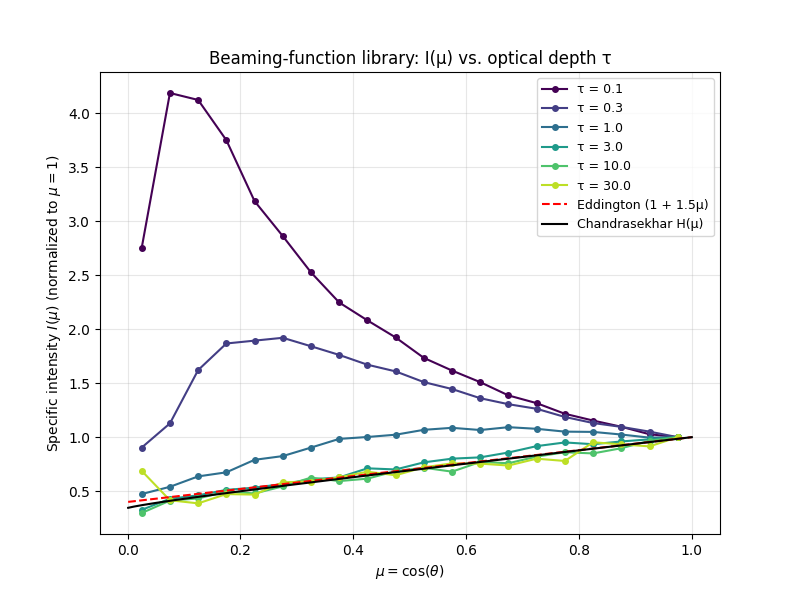
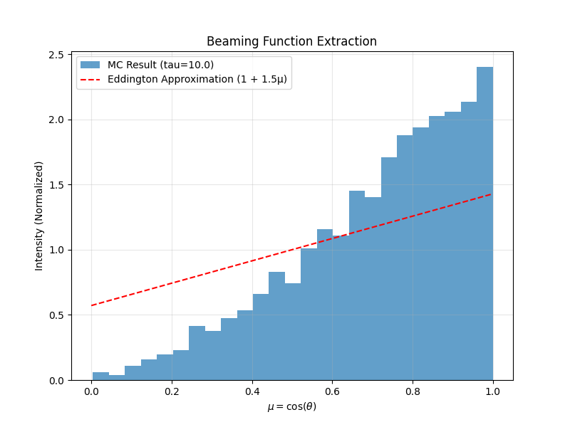
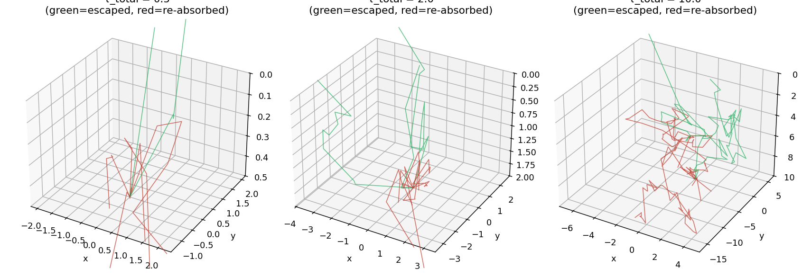
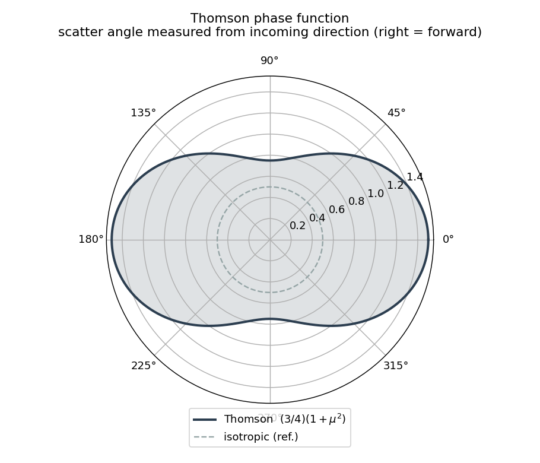

# Monte Carlo Radiative Transfer

We simulate X-ray photons bouncing through the thin layer of plasma that sits on top of a
neutron star. Each photon is followed one scatter at a time until it either escapes into space
or is reabsorbed by the surface. By recording the directions of the photons that escape, we
measure the star's **beaming function** `I(μ)` — how its brightness depends on viewing angle.
That beaming function is the input NASA's NICER telescope needs to turn a pulsing X-ray signal
into a measurement of a neutron star's mass and radius. Most models assume the surface glows
equally in all directions; this project tests how wrong that assumption is.

> **For the full math** behind every step, each progress-log entry links to a matching
> **deep dive** in [`docs/deep-dives/`](docs/deep-dives/) — plain-language, figure-by-figure
> derivations of that version's physics.

---

## Progress Log

*Newest first, tagged by version. Each entry has a one-line headline, why it matters, a figure,
and the technical details tucked underneath, plus a link to its deep dive. The 10-week project
plan in the [Timeline](#timeline) maps calendar weeks onto these versions.*

### v0.6.0 — The beaming function as a function of optical depth
*2026-06-01*

**We now extract the beaming function across a range of atmosphere thicknesses τ, producing a
reusable `I(μ; τ)` library — and that sweep exposed an unphysical limb-brightening at thin τ that
traces back to how photons are injected.**

Pulse-profile synthesis needs the beaming function not at one optical depth but across a range,
because the amount of limb darkening is set by how much a photon scatters before escaping. The
new sweep tabulates `I(μ)` for τ from 0.1 to 30 and saves it as a lookup table. The thick end
behaves exactly as theory demands — the curves collapse onto the Chandrasekhar H-function and the
slope settles at `b ≈ 1.75`. The thin end does **not**: at τ = 0.1–0.3 the fitted slope goes
negative (the star appears *brighter* at its limb than face-on). The cause is the boundary
source — the engine injects photons uniformly in μ, which is isotropic per *solid angle* but not
isotropic in *intensity* — and at thin τ, where almost nothing scatters, that source shines
straight through. Documented here as a baseline; the fix follows in v0.6.x.



📐 **Full derivation:** [v0.6.0 — The Beaming-Function Library and a Thin-τ Anomaly](docs/deep-dives/v0.6.0-beaming-library.md)

<details>
<summary>Technical details</summary>

- **New code:** `scripts/tau_sweep.py` — sweeps `τ ∈ {0.1, 0.3, 1, 3, 10, 30}` at 200k photons
  (fixed seed), reusing `mcrt.beaming`; saves `data/beaming_library.npz` (`tau_values`,
  `mu_centers`, `intensity_by_tau`, `b_of_tau`) plus `beaming_tau_curves.png` /
  `beaming_slope_vs_tau.png`.
- **Library is a data product**, not new package code: a tabulated `I(μ; τ)` the pulse-profile
  stage will interpolate, instead of re-running the Monte Carlo each time.
- **Thick-τ validated:** for τ ≥ 3, RMS deviation from Chandrasekhar H is 0.03–0.08; τ = 10
  reproduces the v0.5.1 curve. `b(τ)`: `[-0.88, -0.53, +0.53, +1.66, +1.69, +1.75]`.
- **Known defect:** thin-τ limb brightening (`b < 0`). At τ = 0.1, ~84% of escapers never
  scatter, so the emergent field is the injected source. Uniform-in-μ injection over-produces
  grazing photons relative to an isotropic-intensity source (which emits `N(μ) ∝ μ`); the
  flux→intensity `÷μ` step then turns flat counts into `I ∝ 1/μ`. Fix tracked for v0.6.1
  (`costheta = sqrt(U)`).
</details>

**Next:** make the source isotropic in intensity (`costheta = sqrt(U)`), regenerate the library,
and confirm `b(τ)` rises cleanly 0 → 1.75 (v0.6.1).

---

### v0.5.1 — The beaming function matches theory, after fixing flux vs. intensity
*2026-05-28*

**A reviewer flagged that our beaming curve didn't follow theory. The cause was measuring the
wrong quantity — once corrected, it tracks the classical limb-darkening laws.**

The original code histogrammed escaping photons directly, which measures the emergent *flux* —
not the *specific intensity* that the Eddington and Chandrasekhar laws describe. A photon
escaping at angle θ carries a factor μ = cos θ of normal flux, so dividing the binned counts by
μ recovers the intensity. After the fix, the Monte Carlo curve sits right between the Eddington
`1 + 1.5μ` law and the exact Chandrasekhar H-function, and a photon-count study shows the best
fit settling down as the statistics improve.



📐 **Full derivation:** [v0.5.1 — Beaming Function: Flux vs. Intensity](docs/deep-dives/v0.5.1-beaming-correction.md)

<details>
<summary>Technical details</summary>

- **The fix:** `I(μ) ∝ N(μ)/μ` — divide the binned escape counts by the bin-center μ to convert
  the measured flux into specific intensity.
- **Best fit:** limb-darkening slope `b ≈ 1.7` (Eddington predicts 1.5; the true H-function is
  slightly steeper than the linear law, so `b > 1.5` is expected).
- **Parameter study:** `data/beaming_convergence.png` — the fitted slope is noisy at low photon
  counts and settles toward ~1.7 as N grows from 2k → 200k (a convergence trend, not drift).
- **New code:** `src/mcrt/theory.py` (Chandrasekhar H-function), `src/mcrt/beaming.py`
  (flux→intensity extraction), `scripts/convergence_study.py`.
- **Magnetic effects:** still deferred — to be considered only once the beaming function is fully
  pinned down.
</details>

**Next:** extract beaming functions across a range of τ_total values, then pulse-profile synthesis.

---

### v0.5.0 — Engine validated: conservation & mean free path
*2026-03-14 · commits `f21738d`–`a3abc18`*

**Two physics-independent bookkeeping checks confirm the random walk is sound: no photons are
lost or created, and they travel the right average distance between scatters.**

We validated the engine two ways that rely on no astrophysics at all. First, every injected
photon ends as either *escaped* or *absorbed* — nothing vanishes or is double-counted. Second,
the mean distance between scatters comes out to one optical depth, exactly as the `−ln(U)`
sampling demands. We also extracted a first beaming function from the escape angles — but
comparing it to theory surfaced a subtle measurement error (binning flux rather than intensity),
which is corrected in v0.5.1 above.

<details>
<summary>Technical details</summary>

- **Energy/photon conservation:** every injected photon ends as either *escaped* or *absorbed*;
  5000/5000 accounted for, exactly.
- **Mean free path:** total path length ÷ total scatters ≈ **1.0** optical depth (measured
  ~1.00–1.03), confirming the `−ln(U)` step sampling is correct.
- First beaming-function extraction revealed a flux-vs-intensity mismatch — resolved in v0.5.1.
- Code: `scripts/validate_engine.py`.
</details>

📐 **Full derivation:** [v0.5.0 — Validation & the Beaming Function](docs/deep-dives/v0.5.0-validation.md)

**Next:** correct the beaming-function measurement and compare to analytic limb-darkening laws (v0.5.1).

---

### v0.2.0 — Photons travel through the atmosphere end-to-end
*2026-03-14 · commit `f21738d`*

**A photon can now be injected at the base of the atmosphere, scatter its way through, and
either escape or be reabsorbed — the complete random walk.**

This is the core of the project. Photons start at the bottom moving in random upward
directions, take exponentially-distributed steps, and at each stop scatter off an electron via
Thomson scattering (which slightly prefers forward/backward over sideways). When a photon
reaches the top it escapes and we record its exit angle; if it drifts back down to the surface
it is absorbed. Everything is measured in *optical depth* rather than meters, which keeps the
physics general.



📐 **Full derivation:** [v0.2.0 — Photon Transport](docs/deep-dives/v0.2.0-photon-transport.md)

<details>
<summary>Technical details</summary>

- **Geometry:** 3D Cartesian in optical-depth coordinates; τ = 0 is the top (escape), τ =
  τ_total is the bottom (injection). Plane-parallel slab.
- **Injection:** isotropic over the upward hemisphere (uniform in cos θ, not in θ — see the
  [v0.2.0 deep dive](docs/deep-dives/v0.2.0-photon-transport.md)).
- **Transport:** step size `Δτ = −ln(U)` (exponential free path); Thomson phase function
  `(3/4)(1 + μ²)` via rejection sampling; 3D direction update via `rotate_vector`.
- **Boundaries:** escape at τ ≤ 0 (record exit μ), absorb at τ ≥ τ_total.
- Code: `src/mcrt/monte_carlo.py` (`Photon`, `Simulation`).
</details>

**Next:** validate the random walk against analytic limits (v0.5.0).

---

### v0.1.0 — The building blocks are in place and tested
*2026-01-24 → 2026-03-14 · commits `ab83703`, `f50cd2a`*

**Every random-sampling primitive the simulation depends on is written and unit-tested.**

Before tracking a single photon we needed the small mathematical tools that the random walk is
built from: how far a photon travels before it scatters, which direction it scatters into, and
how to point it correctly in 3D afterward. Each of these is a short, independently-tested
function, so when the full engine was assembled in v0.2.0 we already trusted its parts.



📐 **Full derivation:** [v0.1.0 — Sampling Primitives](docs/deep-dives/v0.1.0-sampling-primitives.md)

<details>
<summary>Technical details</summary>

- `sample_step_size()` — exponential free path via `−ln(U)`.
- `sample_thomson_angle()` — Thomson `(3/4)(1 + μ²)` by rejection sampling.
- `get_random_direction()`, `rotate_vector()` — isotropic directions and scatter rotation.
- pytest suite in `tests/test_physics.py` checks the exponential mean (≈ 1.0), angle bounds,
  and unit-norm preservation under repeated scatters.
- Code: `src/mcrt/utils.py`.
</details>

---

## Reference

### Physics model

A plane-parallel atmospheric slab in optical-depth coordinates:

```
τ = 0        ← TOP (escape surface)
   ↑
   │  photon scatters, propagates
   │
τ = τ_total  ← BOTTOM (injection point)
```

### Design decisions

| Choice | Decision | Rationale |
|--------|----------|-----------|
| **Scattering** | Thomson | Correct phase function P(μ) ∝ (1 + μ²) for electron-dominated atmospheres |
| **Bottom boundary** | Absorb | Standard approach — photons returning downward are "lost to the thermal source" |
| **Energy** | Monochromatic | Isolates the angular redistribution effect; avoids Compton/Klein-Nishina complexity |
| **Polarization** | Not tracked | Second-order effect with high implementation cost |

### What we defer (future work)

| Feature | Why deferred | Impact |
|---------|--------------|--------|
| **Compton scattering** | Requires Klein-Nishina cross-section; energy-dependent opacity | Would allow spectral analysis |
| **Polarization** | Requires Stokes vector tracking; Mueller matrix algebra | Would enable polarimetric predictions |
| **Magnetic effects** | O-mode/X-mode splitting in strong B-fields | Relevant for magnetars |
| **Curved geometry** | Full spherical atmosphere instead of plane-parallel slab | Needed for very extended atmospheres |

These are noted as limitations in the paper and provide clear directions for follow-up studies.

### Project structure

```
mc-radiative-transfer/
├── README.md                  # This file (overview + progress log)
├── pyproject.toml             # Package metadata (installable as `mcrt`)
├── requirements.txt           # numpy, matplotlib, pytest
├── src/
│   └── mcrt/                  # The simulation package
│       ├── __init__.py
│       ├── monte_carlo.py     # Photon + Simulation engine
│       ├── utils.py           # Sampling & geometry primitives
│       ├── beaming.py         # Flux → specific-intensity extraction
│       └── theory.py          # Eddington & Chandrasekhar H-function
├── scripts/                   # Runnable entry points
│   ├── validate_engine.py     # Validation + beaming-function plot
│   ├── convergence_study.py   # Photon-count parameter study
│   ├── tau_sweep.py           # τ sweep → I(μ; τ) beaming-function library
│   └── plot_paths.py          # 3D random-walk visualization
├── tests/
│   ├── conftest.py            # Makes `mcrt` importable without install
│   ├── test_physics.py        # Unit tests for the primitives
│   └── test_theory.py         # Unit tests for the H-function
├── docs/
│   ├── deep-dives/            # Per-version math deep dives
│   │   ├── v0.1.0-sampling-primitives.md
│   │   ├── v0.2.0-photon-transport.md
│   │   ├── v0.5.0-validation.md
│   │   ├── v0.5.1-beaming-correction.md
│   │   ├── v0.6.0-beaming-library.md
│   │   ├── make_figures.py    # Regenerates the figures below
│   │   └── figures/           # Explanatory figures (01–08)
│   ├── monte_carlo_nicer.pdf  # Task list / research plan
│   ├── RNAA_draft.pdf         # Paper draft
│   └── proposal/              # Proposal + future directions
└── data/                      # Simulation outputs (plots + raw data)
```

### Setup & usage

```bash
pip install -e .              # makes `mcrt` importable everywhere
python scripts/validate_engine.py   # validation + beaming-function plot
python scripts/convergence_study.py # photon-count parameter study
python scripts/plot_paths.py        # random-walk visualization
pytest                              # run the unit tests
```

### Timeline

*The 10-week plan, with the version each milestone shipped as:*

- [x] **Weeks 1-2 — v0.1.0**: Physics setup & sampling primitives
- [x] **Weeks 3-4 — v0.2.0**: Monte Carlo engine (photon transport, boundary handling)
- [x] **Week 5 — v0.5.0**: Validation & benchmarking (energy conservation, mean free path)
- [x] **Patch — v0.5.1**: Beaming function corrected (flux→intensity), validated vs. Eddington / Chandrasekhar H
- [~] **Weeks 6-7 — v0.6.0**: Beaming function extracted across τ_total values into a library; thin-τ injection defect found (fix in v0.6.x)
- [ ] **Weeks 8-9**: Pulse profile synthesis (apply to NICER geometry)
- [ ] **Phase 4**: Analysis & paper completion

---

## How to update the progress log

Each version produces **two** linked pieces: a short entry at the **top** of the Progress Log,
and a companion **deep dive** in [`docs/deep-dives/`](docs/deep-dives/) holding the full math.
Bump the version in `pyproject.toml`, name the deep dive `vMAJOR.MINOR.PATCH-<slug>.md`, and keep
the entry headline plain-physics (no code jargon); put code in `<details>` and the derivations in
the deep dive.

```markdown
### vX.Y.Z — <plain-physics headline read in 30 seconds>
*<date>* · commits `abcd123`–`efgh456`

**<One bold sentence: what now works and why it matters for the science.>**

<2–4 sentences of physics context — what was added, what we can now do that we couldn't.>


📐 **Full derivation:** [vX.Y.Z — <title>](docs/deep-dives/vX.Y.Z-<slug>.md)

<details>
<summary>Technical details</summary>

- Method / equation added (with the physics)
- What was validated + the numeric result
- Decisions and rationale
- Code: files touched
</details>

**Next:** <one line>
```

For the companion deep dive, copy an existing file in `docs/deep-dives/` as a template: open
with a link back to its progress-log entry, a **Builds on:** line pointing to the prior deep
dive, the derivation with figures (regenerate via `make_figures.py`), and a closing **Next:**.

Workflow: when a version's work is committed, both pieces are drafted from that version's commits
and figures, then the physics framing is reviewed before they land.
