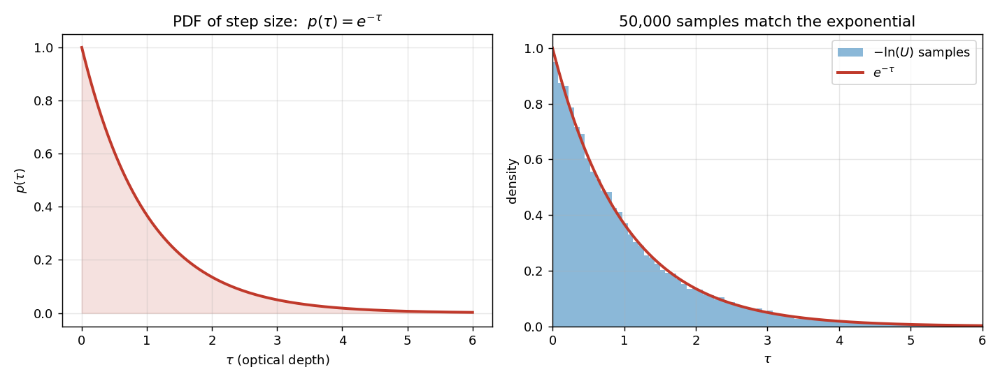
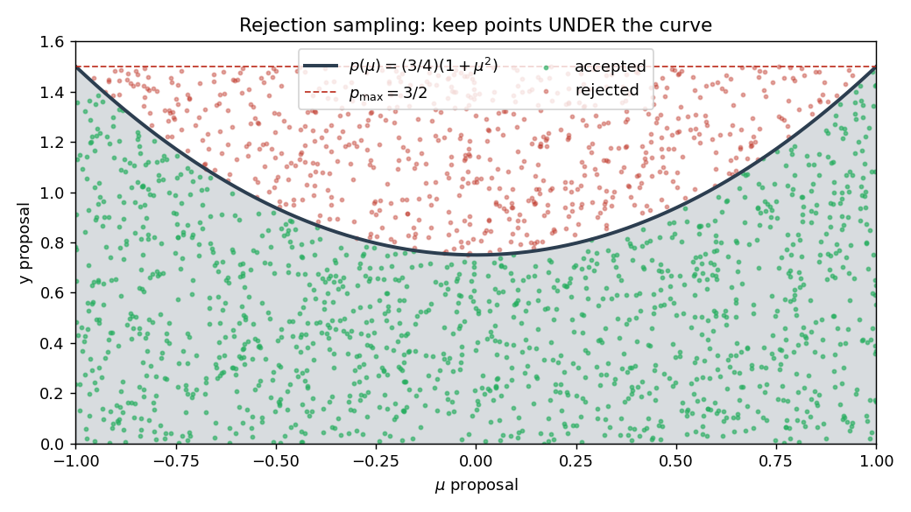
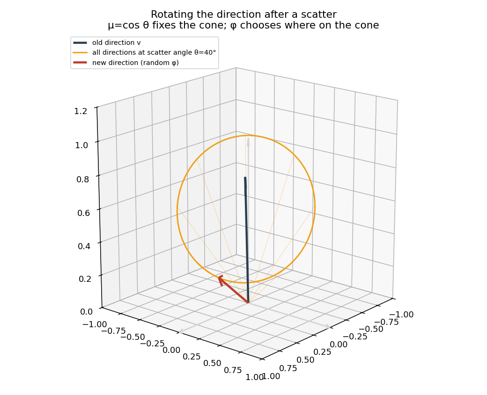

# Deep Dive — v0.1.0: The Sampling Primitives

> Companion to the [v0.1.0 progress-log entry](../../README.md#v010--the-building-blocks-are-in-place-and-tested).
> Covers the math behind `src/mcrt/utils.py`: step sizes, the Thomson phase function, and the
> post-scatter rotation. Read top-to-bottom; each concept builds on the last.
>
> **Builds on:** nothing — this is the foundation. **Leads to:**
> [v0.2.0: Photon Transport](v0.2.0-photon-transport.md).
>
> Figures are generated by [`make_figures.py`](make_figures.py) — rerun it any time you want fresh ones.

---

## 0. Setting the stage

The simulation lives in a **plane-parallel slab** of plasma sitting on top of the neutron-star surface. We do not measure distances in meters; we measure them in **optical depth** τ.

> **Optical depth τ** = "how many scatter-lengths have I crossed?" When τ = 1, the typical photon has scattered once. When τ = 5, it has typically bounced around five times.

In the code's coordinates:
- τ = `tau_total` → **bottom** of the atmosphere (photons injected here).
- τ = 0 → **top** (photons that reach here escape).
- "Up" in the code means `d_tau < 0` (`-z` in the position vector).

Everything that follows is just: pick a random step → move → maybe scatter → repeat.

---

## 1. Step size: why `-log(U)`?

**The physics fact.** The probability a photon travels an optical depth τ *without scattering* is `e^(-τ)`. So the PDF of "distance to the next scatter" is:

$$ p(\tau) = e^{-\tau} $$

**How to sample from it.** Standard trick called **inverse transform sampling**:

1. Write the CDF: `F(τ) = 1 − e^(-τ)`.
2. Set `F(τ) = U` for a uniform `U ∈ [0, 1]` and solve: `τ = −ln(1 − U)`.
3. Since `1 − U` is also uniform, we can simplify: `τ = −ln(U)`.

That's exactly `utils.sample_step_size()`. One line. One log. One random number.

**Why this distribution is right.** Each tiny slab of thickness `dτ` has an independent chance `dτ` of scattering the photon. That's the memoryless property → exponential distribution. Mean step length = 1 (in τ units), which is exactly what the validator checks.

*Left: the exponential PDF. Right: 50,000 samples from `-ln(U)` overlaid on it — perfect match. Most steps are short (τ < 1), but there's a long tail of rare long jumps.*

---

## 2. Thomson scattering — the phase function

When an X-ray photon hits a free electron, it bounces off elastically (no energy change). The probability of scattering at angle θ relative to the *incoming direction* is:

$$ p(\mu) = \frac{3}{4}(1 + \mu^2),\quad \mu = \cos\theta $$

Three things to notice:

1. **Forward/backward symmetric.** `p(+1) = p(−1) = 3/2`. Forward and backward are equally favored.
2. **Slight preference for forward/back over sideways.** `p(0) = 3/4`, so sideways scatters are half as likely as forward/back.
3. **Not isotropic.** A truly isotropic phase function would be flat at `p = 1/2`.

*Polar plot. The peanut-shape sticks out forward (right) and backward (left). The dashed circle is what isotropic would look like.*

### Rejection sampling

To draw a random μ from this distribution, the code uses **rejection sampling** (`utils.py`):

1. Pick a candidate `μ ∈ [−1, 1]` uniformly.
2. Pick a vertical position `y ∈ [0, p_max]` uniformly, where `p_max = 3/2`.
3. Accept μ if `y < p(μ)`; otherwise discard and retry.

Geometrically: throw darts at the bounding box and keep only the ones under the curve.

*Green dots accepted, red dots rejected. Acceptance rate ≈ area-under-curve / box-area = 2/3. The kept μ-values follow the Thomson PDF.*

---

## 3. Rotating the direction after a scatter

After we know how far the photon traveled, we need its new direction. The scatter angle θ (which we just sampled via μ = cos θ) is **relative to the photon's previous direction `v`**, not relative to the lab axes.

So we have two pieces of information:
- The cone half-angle θ — the new direction lies somewhere on a cone around `v`.
- A random azimuth φ ∈ [0, 2π] — *where* on that cone (uniform around the axis).

*The black arrow is the photon's old direction `v`. The orange ring is every direction that makes scatter angle θ with `v`. We pick one point on that ring uniformly at random (red arrow) by choosing φ.*

The formulas in `utils.rotate_vector` are just a numerically-stable way to write that picture in lab coordinates. They build two basis vectors perpendicular to `v` and assemble:

$$ \mathbf{v}_{\text{new}} = \cos\theta\,\mathbf{v} + \sin\theta\,(\cos\phi\,\hat{e}_1 + \sin\phi\,\hat{e}_2) $$

The `if abs(vector[2]) > 0.999` branch is a special case to avoid dividing by ~0 when `v` is nearly vertical — there the basis-vector construction blows up, so we use a simpler form.

You don't have to memorize the algebra. The point is: **(μ, φ) is the new direction in `v`'s own frame; the formula converts it back to the lab frame.**

---

## Quick reference card

| Concept | Code | One-line summary |
|---|---|---|
| Optical depth τ | coordinate | "scatter-lengths traveled" |
| Step size | `sample_step_size` | `−ln(U)` samples `e^(-τ)` |
| Thomson phase | `sample_thomson_angle` | rejection sampling on `(3/4)(1+μ²)` |
| New direction | `rotate_vector` | rotate by (μ, φ) about old direction |

**Next:** these primitives are assembled into a full photon random walk in
[v0.2.0: Photon Transport](v0.2.0-photon-transport.md).
