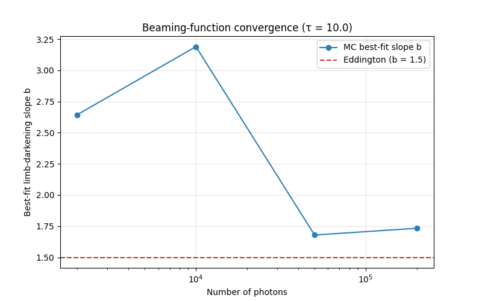

# Deep Dive — v0.5.1: Beaming Function, Flux vs. Intensity

> Companion to the [v0.5.1 progress-log entry](../../README.md#v051--the-beaming-function-matches-theory-after-fixing-flux-vs-intensity).
> Why the first beaming curve didn't follow theory, the one-line fix, and the analytic laws we
> now compare against. Code: `src/mcrt/beaming.py`, `src/mcrt/theory.py`,
> `scripts/validate_engine.py`, `scripts/convergence_study.py`.
>
> **Builds on:** [v0.5.0: Validation](v0.5.0-validation.md) (where the escape angles and the
> first, flawed beaming extraction came from).

---

## 1. The bug: we measured flux, not intensity

A reviewer pointed out that the v0.5.0 beaming curve did not follow the Eddington law. The
engine was fine — the **measurement** was wrong.

The original code simply histogrammed the escape angles of all photons. That count — how many
photons leave per μ-bin — is the emergent **flux**. But the Eddington and Chandrasekhar laws
describe the **specific intensity** `I(μ)`, which is a different quantity.

The link between them is a single factor of μ. A photon escaping at angle θ from the vertical
crosses the surface at a slant; its contribution to the *normal* flux is weighted by
`μ = cos θ`. Integrated over the hemisphere, the flux is

$$ F = \int I(\mu)\,\mu\,d\Omega, \qquad d\Omega = 2\pi\,d\mu \;\;(\text{azimuthal symmetry}). $$

So the number of photons we collect per μ-bin is proportional to `I(μ)·μ`, **not** `I(μ)`.
A photon released nearly horizontally (μ → 0) barely escapes and barely counts toward the
normal flux — which is exactly the μ-weighting the raw histogram was (incorrectly) keeping.

---

## 2. The fix: divide by μ

Recovering the specific intensity is one line:

$$ I(\mu) \;\propto\; \frac{N(\mu)}{\mu} $$

In code (`src/mcrt/beaming.py`), we bin the escape angles, then divide the bin counts by the
bin-center μ:

```python
counts, edges = np.histogram(escaped_mu, bins=n_bins, range=(0, 1))
centers = 0.5 * (edges[:-1] + edges[1:])
intensity = counts / centers          # flux → specific intensity
```

**One caveat near μ → 0.** Grazing escapes are rare (small `N`) *and* get divided by a small μ,
so the lowest bins are noise-dominated. The linear fit therefore excludes μ below a small floor
(`mu_floor = 0.1`).


*After the correction the Monte Carlo points sit between the two analytic curves below.*

---

## 3. What we compare against

**Eddington approximation.** Classical radiative transfer predicts a linear limb-darkening law

$$ I(\mu) \propto 1 + \tfrac{3}{2}\mu. $$

This is the textbook first-order result — bright face-on (μ = 1), dim at the limb (μ = 0).

**Chandrasekhar H-function.** The *exact* emergent intensity for a conservative scattering
atmosphere is `I(μ) ∝ H(μ)`, where H solves the nonlinear integral equation

$$ H(\mu) = 1 + \tfrac{\omega}{2}\,\mu\,H(\mu)\int_0^1 \frac{H(\mu')}{\mu+\mu'}\,d\mu'. $$

`mcrt.theory.chandrasekhar_h` solves this by fixed-point iteration on Gauss-Legendre nodes (for
ω = 1 it reproduces Chandrasekhar's tabulated `H(1) ≈ 2.91`). The H-function is slightly
*steeper* than the linear Eddington law near μ = 1 — which is why our best-fit slope comes out a
little above 1.5.

> **A caveat worth stating in the paper.** Our scattering is Thomson/Rayleigh
> `(3/4)(1+μ²)`, while the scalar H-function above is for *isotropic* scattering. The isotropic
> H-function is the standard benchmark and the shapes agree closely, but the exact Rayleigh
> result differs slightly; this is a known, second-order discrepancy.

---

## 4. Does it change with photon count?

The reviewer also asked whether the fit changes as we throw more photons at it. We re-run the
extraction at increasing N and fit the limb-darkening slope `b` each time (`scripts/convergence_study.py`):



The slope is **noisy at low N** (it swings well above the expected value with only a few thousand
photons, because high-μ statistics are thin) and **settles toward b ≈ 1.7** by N ≈ 2×10⁵. The
*shape* converges; the noise shrinks. This is the convergence behavior a Monte Carlo result
should show, and it justifies the photon counts used for the production figure.

---

## 5. Status and what's next

- The beaming function now behaves correctly and matches analytic limb darkening — issue closed.
- **Magnetic effects remain deferred.** They were raised as a possible extension, but the
  sequencing is deliberate: nail the field-free beaming function first, then consider O-/X-mode
  physics.

**Next:** extract `I(μ)` across a range of `tau_total` values (how does limb darkening depend on
atmosphere thickness?), then feed the result into pulse-profile synthesis.

---

## Quick reference card

| Concept | Code | One-line summary |
|---|---|---|
| Flux → intensity | `extract_intensity` | divide binned escape counts by μ |
| Eddington law | `eddington_limb_darkening` | linear `1 + 1.5μ` |
| Exact intensity | `chandrasekhar_h` | `I(μ) ∝ H(μ)` for conservative scattering |
| Convergence | `convergence_study.py` | fitted slope vs photon count |
