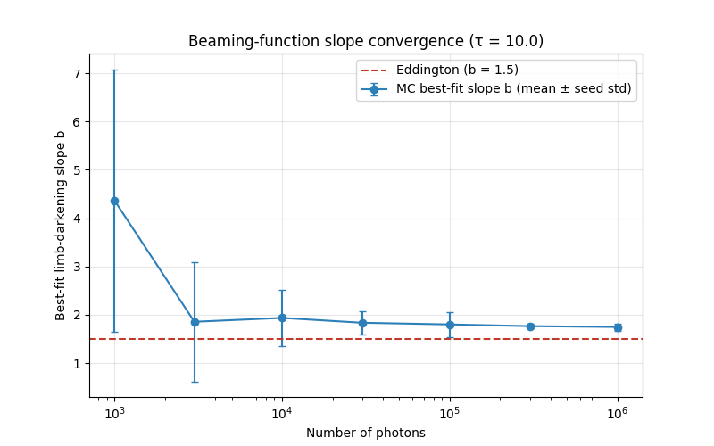

# Deep Dive — v0.7.0: How Many Photons Is Enough? A Convergence Study

> Companion to the [v0.7.0 progress-log entry](../../README.md#v070--how-many-photons-is-enough-the-convergence-study).
> Replaces the by-feel photon counts (5000 / 1000 / 200000) with defensible,
> error-targeted values for the paper's methods/appendix. The −1/2 statistics
> argument, the per-observable error-vs-N curves, the recommended N, and the
> low-μ tail-bin caveat. Code: `src/mcrt/convergence.py`, `scripts/convergence_study.py`
> (the reproducible seeding it relies on shipped in [v0.6.2](v0.6.2-reproducible-seeding.md)).
>
> **Builds on:** [v0.6.2: Reproducible Seeding — An Explicit Generator](v0.6.2-reproducible-seeding.md)
> (the independent, repeatable streams this study measures the spread across), and
> [v0.6.1](v0.6.1-isotropic-injection.md) (whose τ = 30 / low-μ tail noise is exactly the regime
> this study sizes N for).

---

## 1. Why this study, and what "enough" means

Monte Carlo statistical error scales as ~`N^(-1/2)`: each doubling of photons cuts
the noise by only ~30% while doubling the runtime, so the cost-to-precision trade
worsens as N grows. Eventually the statistical noise drops below the *systematic*
floor — finite μ-bin width, the validation tolerance, the Eddington approximation
itself — and extra photons stop buying real precision.

So "enough" is **not one number; it is per observable**. A total-energy check
converges instantly (every photon is counted). A low-μ tail bin of the beaming
function converges much more slowly, because few photons ever escape at grazing
angles. The point of the study is to answer the reviewer's natural question —
*"why 5000 and not 50000, or 500?"* — with a curve instead of a feeling.

### Reproducible seeding (the prerequisite)

This study rests on the reproducible seeding shipped in
[v0.6.2](v0.6.2-reproducible-seeding.md): `Simulation(rng=...)` makes a run repeatable, and
`SeedSequence(base_seed).spawn(...)` hands out the independent streams — one per `(N, seed)`
run — whose across-seed spread is the error estimate used throughout. See that deep dive for the
why and the `np.random` fallback semantics.

---

## 2. Method

- **Sweep** `N ∈ {1e3, 3e3, 1e4, 3e4, 1e5, 3e5, 1e6}` at the binding **τ = 10**,
  **5 independent seeds** per N.
- There is no closed-form "truth" for the noisy tail bins, so the **statistical
  error is the spread (std) across seeds** at each N.
- Plot **error vs N on log-log axes** per observable. While statistics-limited the
  slope is ≈ **−1/2**; it flattens once the systematic floor is hit. **The bend is
  the knee.**
- The knee / error / target-N logic lives in a pure, unit-tested helper
  (`src/mcrt/convergence.py`: `statistical_error`, `loglog_slope`, `find_knee`,
  `n_for_target_error`) rather than buried in the script.

---

## 3. Results

The fitted limb-darkening slope `b` starts wild at `N = 1000` (`b = 4.4 ± 2.7`,
dominated by a handful of grazing escapers) and settles to **`b = 1.75 ± 0.08`** at
`N = 1e6` — consistent with the validated v0.5.1 / v0.6.1 thick-τ value (`b ≈ 1.79`).
The seed-to-seed error bars collapse by roughly the expected `√N` factor.

| N | `b` (mean ± std) | mean free path | tail-bin err (μ≈0.03) | bulk-bin err (μ≈0.68) |
|---|---|---|---|---|
| 1e3 | 4.37 ± 2.72 | 1.031 | — (no escapers) | 0.353 |
| 3e3 | 1.85 ± 1.23 | 1.027 | 0.323 | 0.204 |
| 1e4 | 1.94 ± 0.58 | 1.029 | 0.223 | 0.097 |
| 3e4 | 1.83 ± 0.24 | 1.029 | 0.084 | 0.047 |
| 1e5 | 1.80 ± 0.26 | 1.030 | 0.090 | 0.033 |
| 3e5 | 1.76 ± 0.04 | 1.029 | 0.032 | 0.009 |
| 1e6 | 1.75 ± 0.08 | 1.030 | 0.028 | 0.010 |

**Every observable rides the −1/2 line across the whole range** — fitted log-log
slopes are mean-free-path **−0.58**, slope `b` **−0.57**, bulk bin **−0.55**, tail
bin **−0.45**. None reaches a *persistent* systematic floor by `N = 1e6`, so the
study is honestly **statistics-limited throughout**: the recommended N is set by the
error tolerance each observable needs, read off the fitted −1/2 line, not by a knee.

| Observable | error target | recommended N | note |
|---|---|---|---|
| Energy-conservation residual | — | **any N** | `escaped + absorbed − injected = 0` exactly at every N (structural invariant) |
| Mean free path | 0.5 % | **~4.5e3** | converges fastest; cheap |
| Beaming bulk bin (μ ≈ 0.68) | 2 % | **~1.8e5** | justifies the 200k library / beaming runs |
| Limb-darkening slope `b` | ±0.05 | **~8.2e5** | the slope fit wants ~1e6 for a tight `b` |
| Beaming **tail** bin (μ ≈ 0.03) | 2 % | **~1.5e6 (extrapolated)** | binding case — beyond the swept range |

### The honest tail-bin caveat

The lowest-μ bin is the slowest to converge and the **binding constraint**: at
`N = 1e6` it still carries **~2.8 % error**, its log-log slope (−0.45) is the
shallowest, and meeting a 2 % target needs an *extrapolated* `~1.5e6` photons — more
than the swept range. (At `N = 1000` that bin shows zero spread only because *no*
photon escapes into it across all five seeds — undersampling, not convergence; such
degenerate points are masked from the fit and the figure.) This is the same low-μ /
high-τ corner that makes τ = 30 noisy in the library (see
[v0.6.1](v0.6.1-isotropic-injection.md)). The clean opening here is **variance
reduction** — importance sampling biased toward the under-sampled grazing angles,
with compensating weights to keep the estimator unbiased — a small extension, not a
separate project.

### Recommended production values (replacing the by-feel numbers)

- **Energy conservation:** exact at any N — the old `5000` is harmless margin.
- **Mean free path:** `5000` (the old `1000` gives a ~1.6 % spread; fine for the
  loose 0.9–1.1 assert, but `5000` reaches ~0.5 %).
- **Beaming-function bulk shape / library:** `~2e5` is justified (bulk bins ~2 %, ~1 % by ~3e5).
- **Tight slope `b` or tail-resolved work:** `~1e6`, with tail bins flagged for
  variance reduction.

---

## 4. Performance, and the vectorization decision

The full sweep is **7.2 M photons** (1.44 M × 5 seeds) and ran in **~10 minutes** at
the engine's measured **~11.7 k photons/s** at τ = 10 — a one-shot batch, not an
interactive loop. Runtime was therefore *not* the bottleneck for this deliverable.

This is the natural point to ask whether to **vectorize the engine** so photons
advance simultaneously. The decision: **defer it**, for reasons specific to where the
project is:

- **The project's own plan files speed work as post-paper.**
  [`future_directions §1`](../proposal/future_directions_after_completion.md) notes
  the scalar engine is "fast enough for the core paper"; vectorization matters only
  for multi-parameter sweeps, ≥10⁶-photon tail studies, or fast iteration.
- **This study de-risks vectorization rather than needing it.** Any vectorized engine
  must reproduce the scalar engine's histogram "to within Poisson noise on a fixed
  seed" — which now requires *exactly* the seeded reproducibility (this version) and
  the converged reference N (this study). Vectorizing first would mean validating a
  rewrite against an unseeded, unconverged baseline.
- **The tail bin's binding case has a cheaper, targeted fix than brute force.** If
  tail-resolved work is needed, variance reduction beats a 10–50× engine rewrite for
  the specific low-μ / high-τ problem.

**Cost, for the record (so the deferral is informed):**

| Tier | Approach | Speedup | Effort | Wrinkle |
|---|---|---|---|---|
| A | Numba `@njit` over array functions | 50–100× | ~afternoon | refactor `Photon` out of a class |
| B | Vectorized NumPy: `(N,3)` state + `while any(alive)` mask | 10–50× | ~few days | batch the variable-length Thomson rejection sampler; harder to debug |
| C | GPU (PyTorch / JAX) | +10–100× on B | — | only worth it at ≥10⁶ photons |

Trigger to revisit: when pulse-profile synthesis or a multi-parameter `(τ, T_eff, …)`
grid makes each experiment cost minutes, start with **Tier A**.

---

## 5. Validation and status

- **Sanity preserved:** τ = 10 reproduces `b ≈ 1.75`, matching validated v0.5.1 / v0.6.1.
- **Energy conservation exact** at every N (`max |residual| = 0`).
- **Unit suite:** 23/23 pass — 12 tests on the pure convergence helpers (−1/2 recovery,
  persistent-knee detection, target-N in-range vs extrapolated); the 2 reproducible-seeding
  tests on `Simulation` live in [v0.6.2](v0.6.2-reproducible-seeding.md).

**Next:** pulse-profile synthesis (rotating NS + hot spot), which consumes
`data/beaming_library.npz`.

---

## Quick reference card

| Concept | Code | One-line summary |
|---|---|---|
| Reproducible runs | `Simulation(rng=default_rng(seed))` | explicit Generator threaded through every sampler (v0.6.2) |
| Statistical error | `statistical_error` | spread (std) across independent seeds at fixed N |
| Convergence law | `loglog_slope` | error ∝ N^(−1/2) while statistics-limited (all observables here) |
| Knee | `find_knee` | persistent flattening to the systematic floor — *none in range* here |
| Production N | `n_for_target_error` | photons to hit an error target on the fitted −1/2 line |
| Binding case | μ → 0 tail bin | ~2.8 % at 1e6; needs ~1.5e6 or variance reduction |
| Vectorization | — | deferred; this study is the reference a vectorized engine must match |
