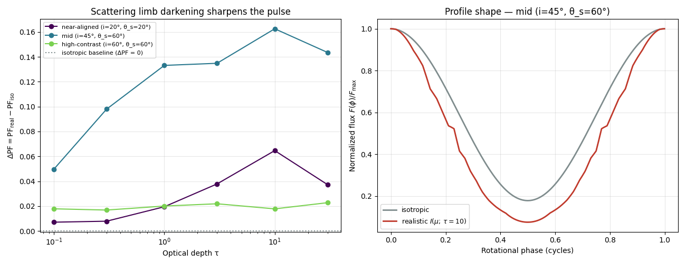

# Deep Dive — v0.9.0: The Beaming Systematic Becomes a Number

> Companion to the [v0.9.0 progress-log entry](../../README.md#v090--scattering-limb-darkening-sharpens-the-pulse).
> The analytic check and the code-comparison check verified the pulse-profile *machinery* against a
> closed form and against the NICER code-comparison codes — both with an **isotropic** spot. **This
> is the first step that produces a result:** hold the geometry fixed, swap the isotropic brightness
> term for the realistic scattering beaming `I(μ; τ)`, and measure how the pulsed fraction changes.
> Code: `scripts/beaming_pulse_sweep.py`, the `test_*beaming*`/`test_limb_darkening_*` cases in
> `tests/test_pulse.py`. References: [`../paper/references.md`](../paper/references.md).
>
> **Builds on:** [v0.8.1 — Agreeing With the Community Codes](v0.8.1-code-comparison.md)
> (the verified point-spot machinery). This version adds **one small pure helper**
> (`beaming_lookup`) and consumes the τ-swept library built back in v0.6.x — it adds
> no new engine physics.

---

## 1. What this comparison asks

The earlier checks answered "is the machine correct?" — yes, to machine precision against a
closed form and to ~1% against the IM ray-tracing code. Every one of those runs
used an **isotropic** spot (`I ≡ 1`). The whole point of the project is the
*alternative*: a surface whose brightness depends on emission angle because photons
scatter their way out of a thin atmosphere — the beaming function `I(μ; τ)` measured
in v0.5–v0.6 and tabulated in `data/beaming_library.npz`.

This is the controlled experiment that isolates that physics:

> Run the **identical** geometry twice — once isotropic, once with `I(μ; τ)` — and
> report `ΔPF = PF_real − PF_iso`.

Because only the brightness term changes, ΔPF cannot come from the geometry shifting
underneath it. It is the **beaming systematic**, clean.

---

## 2. The one-line swap, and why it is honest

The v0.8.0 module was built with this seam in place. `point_spot_flux` computes

```
F(φ) ∝ (1 − u) · I(cos α) · cos α       where visible, else 0
```

with `beaming=None` meaning `I ≡ 1`. Here we pass a real `I(μ)`:

```python
from mcrt import beaming_lookup, compute_profile, pulsed_fraction

beaming = beaming_lookup(mu_centers, intensity_by_tau[k])   # one τ row of the library
iso  = compute_profile(i, θ_s, u)                            # I ≡ 1
real = compute_profile(i, θ_s, u, beaming=beaming)           # I(μ; τ)
ΔPF  = pulsed_fraction(real.flux) - pulsed_fraction(iso.flux)
```

`beaming_lookup` is a pure 1-D linear interpolation of the tabulated curve, **clamped**
at the μ→0 / μ→1 ends (the grazing tail is the noisiest part of the library — the bins
`fit_limb_darkening_slope` already excludes below μ≈0.1 — so the curve is held at its
end value rather than extrapolated). A unit test pins that the isotropic and beamed
runs share `cos α` and the visibility mask **exactly** (`np.array_equal`): the geometry
is provably untouched, only `flux` differs.

---

## 3. The sign: limb darkening sharpens the pulse

The library curves rise with μ — limb darkening, the surface is brighter viewed
face-on (μ = cos α near 1) than at a graze (small μ). The slope `b(τ)` climbs from
0.29 at τ=0.1 to a peak of 1.79 near τ=10, then eases to 1.67 by τ=30 (the
finite-slab departure from the semi-infinite Eddington limit — caveat 2 of
`to_finish.md §10`).

Map that onto a rotation. At the **bright phase** the spot faces us, so μ is at its
largest and `I(μ)` multiplies the flux by the most; at the **faint phase** the spot is
near the limb, small μ, least boost. Limb darkening therefore *widens* the max/min
contrast — `PF_real > PF_iso`. The pulse **sharpens**. This is locked into a test
(`test_limb_darkening_raises_pulsed_fraction_vs_isotropic`) using the analytic
Eddington law as a monotone stand-in, so the sign claim does not depend on the
specific library numbers.



---

## 4. The result — ΔPF, swept over geometry and τ

Three always-visible geometries at the canonical `u ≈ 0.3445` (M = 1.4 M⊙, R = 12 km,
the code-comparison operating point). "Always-visible" matters: an eclipse pins `PF = 1` for
*both* beamings (F_min = 0), which would trivialize ΔPF — so we stay where the spot
never sets, to expose the systematic.

| Geometry | PF_iso | PF_real (τ=10) | **ΔPF (τ=10)** | trend over τ |
|---|---|---|---|---|
| near-aligned (i=20°, θ_s=20°) | 0.083 | 0.148 | **+0.065** | rises to τ≈10, dips at 30 |
| mid (i=45°, θ_s=60°) | 0.697 | 0.859 | **+0.163** | rises to τ≈10, dips at 30 |
| high-contrast (i=60°, θ_s=60°) | 0.967 | 0.985 | **+0.018** | ~flat |

Reading the table:

- **ΔPF > 0 everywhere** and **grows with τ**, peaking near τ≈10 and easing at τ=30 —
  it tracks `b(τ)` because a steeper limb-darkening curve means a stronger contrast
  boost. That τ=30 dip is a genuine consistency check: the systematic follows the
  measured beaming slope, finite-slab roll-off and all.
- **ΔPF is largest at the mid geometry, not the most modulated one.** The near-aligned
  spot barely modulates μ (so limb darkening has little to differentiate); the
  high-contrast spot already sits at `PF_iso ≈ 0.97` (F_min → 0), so there is almost no
  headroom. Beaming has the most leverage in between — here **ΔPF reaches +0.16**, a
  16-percentage-point change in the pulsed fraction.

That +0.16 is the headline. It also **replaces the fabricated "∼15%" pulsed-fraction
number** in the old draft (`to_finish.md §6/§10`): the real, measured, geometry-honest
answer is "a few percent to ~16%, depending on geometry, growing with optical depth."

---

## 5. Honest scope (carried from `to_finish.md §7, §10`)

- **Monochromatic / bolometric.** We compare pulse *shape* and PF, not energy-resolved
  profiles. NICER is energy-dependent; that is a stated limitation, not a bug.
- **Conservative Thomson scattering.** The library is the ϖ = 1, Rayleigh/Thomson
  ¾(1+μ²) solution; the base removes photons rather than truly absorbing. Real NS
  atmospheres (NSX, McPhac) add frequency dependence, true absorption, polarization.
- **Slow-rotation Schwarzschild.** No Doppler, aberration, or oblateness — adequate for
  a differential result at the low-spin operating point; noted as a limitation.
- The number is a **differential** (isotropic → realistic at fixed geometry), which is
  exactly why the verification steps had to pass first: the geometry beneath the swap is
  verified, so ΔPF is physics, not plumbing.

---

## 6. Status

- **Result delivered:** ΔPF measured across three geometries × six optical depths,
  positive throughout, peaking at ΔPF ≈ +0.16 (mid geometry, τ≈10).
- **Tests: 39/39 pass** (three new cases: lookup interpolation/clamping, the
  ΔPF sign, and geometry invariance).
- **One small pure helper added** (`beaming_lookup`); no engine-physics change. The
  `BeamingFunc` type now lives in `beaming` and is reused by `pulse`.

**Next:** the real-star anchor (v0.9.1) — anchor the swap at PSR J0030+0451's published geometry
(Riley 2019 / Miller 2019) and compare the differential ΔPF to NICER's quoted PF / M–R
uncertainty. **Differential, not a fit** (`to_finish.md §6`).

---

## Quick reference card

| Concept | Value / code | One-line summary |
|---|---|---|
| The swap | `compute_profile(..., beaming=beaming_lookup(...))` | isotropic vs. `I(μ; τ)`, identical geometry |
| Helper | `beaming_lookup` (in `mcrt.beaming`) | clamped linear interp of one τ row |
| Sign | ΔPF > 0 | limb darkening sharpens the pulse |
| Headline | **ΔPF ≈ +0.16** | mid geometry (45°/60°), τ≈10 |
| Range | +0.02 … +0.16 | geometry-dependent; grows with τ |
| τ trend | peaks at τ≈10, dips at 30 | tracks the measured slope `b(τ)` |
| Replaces | the draft's fabricated "∼15%" | with a real, measured number |
| Reproduce | `scripts/beaming_pulse_sweep.py` | → `data/pulse_profile_beaming.png`, `data/beaming_pulse_sweep.npz` |
