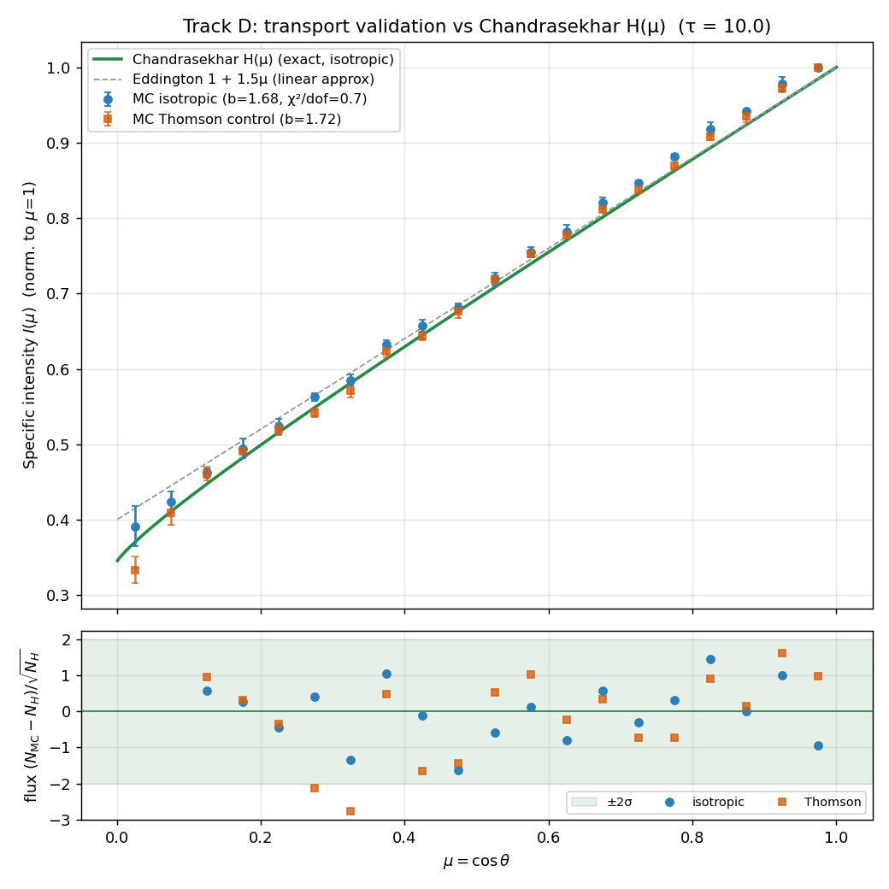

# Deep Dive — v0.9.11: Exact Transport Validation against Chandrasekhar H(μ) (Track D)

> Records **Track D** of `next-steps.md`: add an opt-in **isotropic-scattering** phase function
> to the engine, run one thick slab with it, and certify that the transport/escape/binning
> machinery reproduces **Chandrasekhar's H(μ)** — the *exact* emergent intensity for that phase
> function — within Monte Carlo error. This closes attention-point **item 2** (the isotropic-H
> vs Thomson conflation) and backs the item-7 "converges to the semi-infinite limit" sentence
> with a measured goodness-of-fit.
>
> **Status: D1 (isotropic sampler + opt-in wiring) — done. D2 (thick-slab run) — done. D3
> (H(μ) overlay + χ²) — done.** Verdict: at τ = 10, 5 seeds, 4.1×10⁵ escaped photons, the
> isotropic engine matches H(μ)·μ with **flux-space reduced χ² = 0.70** (dof 17, max residual
> 1.6σ). The Thomson control — the same machinery with the *physical* dipole phase function —
> sits at **χ² = 1.49** (max residual 2.8σ, max deviation 2.8%): the ~1–3% phase-function
> sensitivity, so H is a **near-exact** reference, never the exact one for the real atmosphere.
>
> **Builds on:** [v0.5.1](v0.5.1-beaming-correction.md) (H(μ) first introduced as the reference),
> [v0.6.1](v0.6.1-isotropic-injection.md) (the ∝μ Lambertian injection this test reuses),
> [v0.7.0](v0.7.0-convergence-study.md) (the escaped-photon error budget),
> [v0.9.7.1](v0.9.7.1-production-library.md) (attention-fix 8b — the bin-center bias that made
> the *intensity*-space check the wrong test).
>
> Code: `src/mcrt/utils.py` (`sample_isotropic_angle`), `src/mcrt/monte_carlo.py` (opt-in
> `phase_function=` argument, default `"thomson"` bit-for-bit unchanged),
> `scripts/d_isotropic_validate.py` (new driver), `tests/test_transport.py` (new, 8 tests).
> No new long compute — the slab run is ~80 s on 10 workers.

---

## 1. Why this is the one exact check available

Every other validation in this project compares the Monte Carlo against something that is itself
approximate or empirical: the Beloborodov bending map (~1%, superseded in Track B), the SD1a/SD1c
NICER code comparisons (independent code, but same physics, ~0.1–1.4% residual), the Eddington
limb-darkening law (only the *linear* term of the truth). There is exactly one place where a
**closed-form, exact** answer exists for our geometry:

> A conservative (albedo ω = 1), semi-infinite, plane-parallel atmosphere that scatters
> **isotropically** emits specific intensity **I(μ) ∝ H(μ)**, where H is Chandrasekhar's
> H-function (`mcrt.theory.chandrasekhar_h`, solved by fixed-point iteration on Gauss–Legendre
> nodes). — Chandrasekhar, *Radiative Transfer*, Ch. III/X.

The catch: our engine physically scatters via the **Thomson** dipole P(μ) = (3/4)(1 + μ²), for
which *no* closed form exists. So the emergent curve is only ever bracketed (Eddington below,
H above) — never checked exactly. Track D removes that gap by controlling the one variable that
blocks the check: **swap the phase function to isotropic** and the answer becomes H(μ), exactly.
If the MC reproduces H, then transport (step sampling, boundaries, escape) + geometry (the ∝μ
Lambertian source, the histogram) are certified with the phase function held fixed. The physical
Thomson run is then carried alongside as a *control*, and the gap between it and H is the
phase-function sensitivity — the thing the paper must not paper over.

Two conditions make τ = 10 valid as "semi-infinite": (i) the v0.9.7 convergence redo showed
b(τ = 10) ≡ b(τ = 30) — the slope is on a plateau, so the slab is optically deep enough that the
absorbing base is invisible to the emergent angular distribution; (ii) the deep source sits at
10 mean free paths, so a photon that escapes has forgotten its Lambertian launch. This is the
Milne-problem regime, where I(μ) ∝ H(μ) holds.

## 2. The isotropic sampler (D1)

Isotropic scattering redistributes a photon uniformly over solid angle, so the scattering-angle
cosine is **uniform on [−1, 1]** (phase function P(μ) = 1/2, a constant). Compare the Thomson
sampler, which rejection-samples the forward/back-peaked P(μ) = (3/4)(1 + μ²):

```python
def sample_isotropic_angle(rng=None):
    if rng is None:
        rng = np.random
    return rng.uniform(-1.0, 1.0)
```

Wiring is opt-in and default-preserving. `Simulation(..., phase_function="thomson")` (the default)
selects `sample_thomson_angle` — the *identical* call the engine made before — so every existing
run, library, and anchor is **bit-for-bit unchanged** (`test_default_phase_function_is_thomson_bit_for_bit`
asserts byte-identical escape arrays and absorbed counts under a shared seed). `phase_function="isotropic"`
selects the new sampler; an unknown value raises `ValueError`. The dispatch is a small module-level
dict `SCATTER_SAMPLERS`, so adding a phase function later is one entry.

## 3. The subtlety: test in *flux* space, not *intensity* space (D3)

The naïve check — reconstruct I(μ) = counts/μ (via `extract_intensity`), normalize to the μ≈1
bin, and compare to H(μ) — **fails**, and the failure is instructive: at the full 4×10⁵-escaped
budget it gives reduced χ² = 11.7, and the Thomson control (χ² = 4.5) looks *better* than the
isotropic run it is supposed to lose to. That is not a transport error. It is the **bin-center
division bias** (attention-fix 8b): the flux escaping in a bin is ∫ I(μ)·μ dμ over the bin, and
dividing that integral by the bin *center* μ mis-estimates I by O(Δμ²) — a ~few-% systematic
that *grows* with statistics (smaller error bars → larger χ²) and masquerades as a real deviation.
It affects both phase functions similarly, so it swamps the ~1–3% signal we are trying to measure.

The fix is to test the quantity the MC measures **directly**, with no reconstruction: the raw
**escaping angular distribution**. A semi-infinite isotropic atmosphere emits photons with density
∝ **H(μ)·μ** (the μ is the cos-θ projection of the emergent flux). So compare per-bin escape
*counts* to

    exp_i  =  N · ∫_bin H(μ)·μ dμ  /  Σ_interior ∫ H(μ)·μ dμ

with multinomial/Poisson errors, χ² = Σ (counts − exp)² / exp over interior bins (μ > 0.1, one
normalization constraint ⇒ dof = 17). No μ-division, no arbitrary normalization bin. The H·μ
integral is done by dense per-bin trapezoid, so the *prediction* carries no binning approximation
of its own while the MC side is exact counts.

**This is the correct transport certificate, and it passes cleanly:**

| phase function | role | escaped | flux-space χ²/dof (vs H·μ) | max residual | max \|Δflux/flux\| |
|---|---|---|---|---|---|
| **isotropic** | validation | 4.09×10⁵ | **0.70** (dof 17) | 1.6σ | 1.4% |
| Thomson | control | 4.07×10⁵ | 1.49 (dof 17) | 2.8σ | 2.8% |

τ = 10, 5 seeds × 7×10⁵ injected, `BASE_SEED = 20260707`. Driver: `scripts/d_isotropic_validate.py`
→ `data/d_isotropic_h.npz` + the overlay figure.



The intensity overlay (top panel) is the *picture* — all points hug the green H curve because the
normalization-to-μ≈1 and the shared bin-center bias hide the flux-space difference. The **residual
panel** (bottom, flux space) is the *verdict*: every isotropic point (blue) sits inside ±2σ, while
the Thomson control (orange) is pulled systematically off — most visibly the −2.8σ dip near μ ≈ 0.3,
where the dipole beams more strongly toward the normal than isotropic scattering does.

## 4. What this certifies, and what it does not

**Certifies (χ² = 0.70):** with the phase function controlled, the transport machinery —
exponential step sampling, the plane-parallel boundaries, the escape condition, the ∝μ Lambertian
source, and the histogram — reproduces the exact analytic emergent distribution. Any remaining
model risk lives in the *physical* pieces layered on top (bending, Doppler, geometry), which are
validated separately by the SD1a/SD1c code comparisons. The transport core is no longer an
unchecked assumption.

**Does not certify:** that the *physical* atmosphere emits H(μ). It does not — the Thomson control
deviates by 2.8% (χ² = 1.49), which is the **phase-function sensitivity** (Chandrasekhar Ch. X:
Rayleigh/Thomson vs isotropic differ at the ~1–3% level in the emergent intensity). This is the
number that forces the paper wording in Track F: the Thomson-vs-isotropic-H overlay is a
**near-exact** reference, and one must **never** write "matches the exact solution" without the
~1–3% phase-function caveat. The isotropic run *is* exact-within-error against H; the physical run
is near-exact, by a measured margin.

## 5. Tests and reproduction

`tests/test_transport.py` (8 tests, suite now **119 green**):
- sampler is in [−1, 1] and uniform (mean ≈ 0, variance ≈ 1/3);
- isotropic is flatter than Thomson near |μ| = 1;
- default path is bit-for-bit Thomson; isotropic differs; bad phase function raises;
- a fast (τ = 10, 6×10⁴ injected, deterministic seed) flux-space χ² < 3.0 guard, which the full
  driver tightens to 0.70.

```bash
PYTHONPATH=src python3 scripts/d_isotropic_validate.py           # full run (~80 s, 10 workers)
PYTHONPATH=src python3 scripts/d_isotropic_validate.py --quick   # plumbing check (seconds)
PYTHONPATH=src python3 -m pytest tests/test_transport.py -q
```

**Paper sentence this earns (Track F, item 7):** *"With the scattering phase function set to
isotropic, the emergent intensity reproduces Chandrasekhar's H-function to within Monte Carlo
error (flux-space reduced χ² = 0.70 at τ = 10), certifying the transport and geometry machinery;
the physical Thomson dipole deviates from H by the expected ~1–3% phase-function sensitivity, so H
serves as a near-exact — not exact — reference for the scattering atmosphere."*
