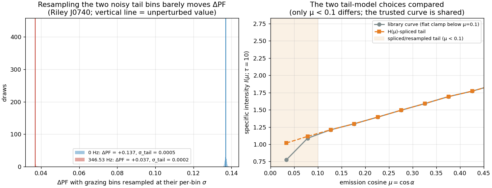
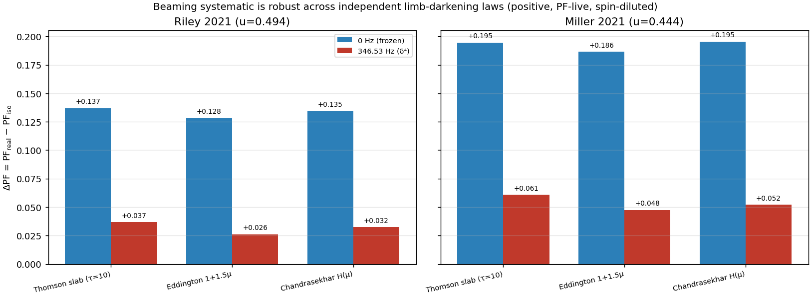

# Deep Dive — v0.9.12: Tail Sensitivity (E2) and Atmosphere-Law Robustness (E3)

> Records **Track E2 + E3** of `next-steps.md`: the two post-library quantifications that
> harden the J0740 headline against a referee's two cheapest attacks — *"your grazing tail is
> noisy and you clamped it"* (E2, attention-point **item 4**) and *"your Thomson slab isn't a
> hydrogen atmosphere"* (E3). Both are pure interpolation + geometry on the production library,
> and both are run **static and at the real 346.5 Hz**, because the Doppler-diluted number is
> the one the paper quotes (v0.9.10 ripple).
>
> **Status: E2 (tail sensitivity) — done. E3 (atmosphere-law robustness) — done.** Verdict:
> the clamped grazing tail is **not load-bearing** (every induced σ and tail-model systematic
> ≤ 0.006, at or below the ±0.003 seed error bar), and the systematic is **robust across three
> independent limb-darkening laws** (same sign, same geometry-routing; magnitude tracks the
> limb-darkening slope b). Nothing about the headline depends on the slab being special or on
> the tail model.
>
> **Builds on:** [v0.9.7.1](v0.9.7.1-production-library.md) (the per-bin σ and attention-fix
> 8a/8b this perturbs), [v0.9.7.2](v0.9.7.2-downstream-rerun.md) / [v0.9.9](v0.9.9-exact-bending.md)
> (the exact-bending +0.137/+0.195 headline these reproduce as their baseline),
> [v0.9.10](v0.9.10-doppler.md) (the 346.5 Hz δ⁴ dilution and shape-routing the rotation-on rows
> stack on), [v0.9.11](v0.9.11-isotropic-transport.md) (Chandrasekhar H(μ), reused here both as
> the spliced tail model and as an E3 robustness law).

---

## 1. Why these two, and why now

The headline is **ΔPF = PF_real − PF_iso = +0.137 ± 0.003 (Riley) / +0.195 ± 0.005 (Miller)** at
τ = 10 (exact bending), diluting to **+0.037 / +0.061** at 346.5 Hz. Two structural worries about
the beaming curve that feeds it were logged but not measured:

- **The grazing tail (item 4).** The library's two lowest-μ bins (μ ≈ 0.034, 0.078) are its
  noisiest — per-seed scatter **5.4%** and **3.2%**, versus ~0.6% just above μ = 0.1 — because a
  photon escaping near the limb is rare and `counts/μ` divides a tiny count by a tiny μ. Those are
  exactly the bins `fit_limb_darkening_slope` excludes below μ_floor = 0.1, and `beaming_lookup`
  holds the curve **flat** (a `np.interp` clamp) below the first bin. Does that noisy, arbitrarily
  clamped tail move ΔPF?
- **The atmosphere law.** Every number so far uses one limb-darkening model, the Monte Carlo
  Thomson slab. Is the effect a property of *limb darkening*, or an artifact of *this* slab?

Both are answered on the frozen curve **and** at spin, because aberration samples the beaming at
the aberrated cosine μ' = δ cos α, reaching into the tail at the faint phases — so the
spin-diluted number has its own tail sensitivity the frozen one does not inherit.

Both drivers reproduce the published headline **exactly** as their reference case (Riley +0.1370,
Miller +0.1946 static; +0.0368 / +0.0608 at spin), which is the cross-check that the perturbations
are the *only* thing changing.

## 2. E2 — tail sensitivity (`scripts/e2_tail_sensitivity.py`)

Two independent measurements, J0740 only (J0030 saturates: ΔPF ≡ 0 for every beaming, so its tail
sensitivity is identically nil).

**(a) Bin resampling → induced σ(ΔPF).** Perturb *only* the μ < 0.1 bins by their measured per-bin
σ — the per-seed scatter `intensity_std_by_tau`, a deliberately conservative upper bound (the
pooled headline uses the mean, whose error is √5 smaller) — 500 draws, push each perturbed curve
through the anchor pipeline, and take the spread of ΔPF. This is how much of the ΔPF error bar the
two noisy grazing bins alone can account for.

**(b) H(μ)-tail splice → tail-model systematic |δ(ΔPF)|.** Replace the two tail bins' flat/noisy
values with a **Chandrasekhar-H-shaped** tail (v0.9.11's H(μ)), scaled to join the first *trusted*
bin (μ ≈ 0.127, σ ≈ 0.6%) continuously, and measure how far ΔPF moves. H is monotone increasing,
so this replaces the flat clamp with a physically-motivated tail that darkens toward the limb —
the opposite modelling choice from the clamp, a genuine systematic probe rather than a statistical
one.

| anchor | spin | ΔPF (clamp) | σ_tail(ΔPF) | ΔPF (H-tail) | \|δ\| model |
|---|---|---|---|---|---|
| Riley  | 0 Hz     | +0.1370 | 0.0005 | +0.1380 | 0.0011 |
| Riley  | 346.5 Hz | +0.0368 | 0.0002 | +0.0368 | 0.0000 |
| Miller | 0 Hz     | +0.1946 | 0.0000 | +0.1946 | 0.0000 |
| Miller | 346.5 Hz | +0.0608 | 0.0010 | +0.0549 | 0.0059 |

**Reading.** Every tail effect is **≤ 0.006**, at or below the ±0.003 seed error bar on the
headline — the clamped grazing tail is not load-bearing. The one number worth a sentence is
**Miller at spin**: the H-splice moves ΔPF by 0.006 (and the resample σ is largest there too),
because Miller's near-equatorial spots graze and *aberration reaches into the tail* at the faint
phases, so the tail matters more once the star spins than it ever does frozen — exactly the
v0.9.10 ripple that justified running E2 rotation-on. Even so, 0.006 is a fraction of the +0.061
number it perturbs. Miller *static* is insensitive to the tail to 4 dp: its min/max PF extremes
sit at phases where μ' never enters the tail, so the tail bins never touch the statistic until
spin aberrates them in.



## 3. E3 — atmosphere-law robustness (`scripts/e3_atmosphere_laws.py`)

Re-run the *identical* J0740 swap under three limb-darkening laws — the Thomson slab (reference)
plus two independent analytic laws already in `mcrt.theory`: **Eddington** I(μ) = 1 + 1.5μ and
**Chandrasekhar** I(μ) ∝ H(μ). Nothing else changes (same spots, compactness, exact bending, same
isotropic baseline). Because PF is a ratio, ΔPF is invariant to each law's overall normalization —
only its μ-shape matters, so the comparison is clean. Each law is reported at 0 Hz and 346.5 Hz.

| law | b | Riley ΔPF(0) | ΔPF(346) | RMS(0) | Miller ΔPF(0) | ΔPF(346) | RMS(0) |
|---|---|---|---|---|---|---|---|
| Thomson slab (τ=10) | 1.79 | +0.1370 | +0.0368 | 0.107 | +0.1946 | +0.0608 | 0.125 |
| Eddington 1+1.5μ    | 1.50 | +0.1284 | +0.0262 | 0.103 | +0.1865 | +0.0476 | 0.122 |
| Chandrasekhar H(μ)  | 1.68 | +0.1345 | +0.0325 | 0.106 | +0.1955 | +0.0522 | 0.127 |

**Reading.** All three laws give a **positive, PF-live** static ΔPF (+0.128…+0.196) that the real
spin dilutes to **+0.026…+0.061** while the peak-normalized waveform-shape RMS stays **~0.10–0.13**
— the same sign and the same geometry-routing (PF-visible at J0740, spin-diluted, shape-conserved)
under every law. The magnitude ordering tracks the limb-darkening slope **b**: Eddington (b = 1.50,
the shallowest) gives the smallest ΔPF, the Thomson slab (b = 1.79) the largest, H (b = 1.68)
between — exactly as a "steeper limb-darkening ⇒ bigger swap" mechanism predicts. The Thomson slab
is representative, not special; the effect is a property of limb darkening itself.



## 4. Decisions and rationale

- **Conservative σ for E2(a).** Using the per-seed scatter (not the √5-smaller SEM of the pooled
  mean) makes the induced σ an *upper bound* on the tail's contribution to the error bar — the
  honest direction for a "does this destabilize us" check.
- **H(μ) as the splice model.** The tail-model systematic needs a *different* shape from the flat
  clamp to be meaningful; H is the physically-correct emergent shape for a scattering atmosphere
  (v0.9.11) and darkens toward the limb, the maximal contrast with a flat clamp.
- **Analytic laws evaluated continuously.** E3's Eddington/H are passed as their exact callables
  (no re-binning, no clamp), so they are genuinely independent models — a re-binned copy of the
  slab would not test what the referee asks.
- **J0740 only.** Both tracks target the PF-live anchors; J0030's ΔPF ≡ 0 is beaming-independent,
  so neither a tail perturbation nor a law swap can move it (verified structurally, not re-run).

## 5. Tests and reproduction

`tests/test_sensitivity.py` (8 tests, suite now **127 green**):
- zero-σ resampling reproduces the baseline ΔPF bit-for-bit and yields σ = 0;
- the H-splice touches only the μ < 0.1 bins, leaves the trusted curve untouched, and joins it
  continuously (monotone, below the anchor bin);
- ΔPF is invariant to scaling a beaming law by a constant (the "PF is a ratio" property E3 leans on);
- each analytic law is PF-live (ΔPF > 0.10) and spin dilutes it without flipping the sign;
- data-gated: the E2 clamp baseline reproduces the +0.137 / +0.195 headline, and the tail σ and
  H-splice systematic both land under ±0.003.

```bash
PYTHONPATH=src:scripts python3 scripts/e2_tail_sensitivity.py    # tail sensitivity (seconds)
PYTHONPATH=src:scripts python3 scripts/e3_atmosphere_laws.py     # law robustness (seconds)
PYTHONPATH=src python3 -m pytest tests/test_sensitivity.py -q
```

**Paper sentences this earns.** *"Perturbing the two noisiest, grazing (μ < 0.1) beaming bins
within their measured per-bin scatter, and replacing the clamped tail with a Chandrasekhar-H-shaped
one, shifts ΔPF by ≤ 0.006 — at or below the seed error bar — so the systematic does not depend on
the low-μ tail model."* And: *"Repeating the swap under the Eddington (1 + 1.5μ) and Chandrasekhar
H(μ) limb-darkening laws reproduces the same positive, spin-diluted ΔPF (+0.13…+0.20 static,
+0.03…+0.06 at spin) with the magnitude tracking the limb-darkening slope, confirming the effect is
a property of limb darkening rather than of the Thomson-slab model."*

**Next:** E1 — propagate these numbers and the three-part routing framing through the anchor
scripts and README, then Track F scope paragraphs → v1.0.0-rc, the paper.
