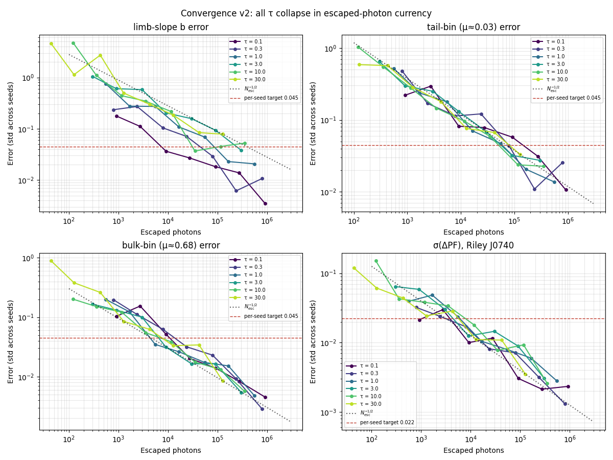
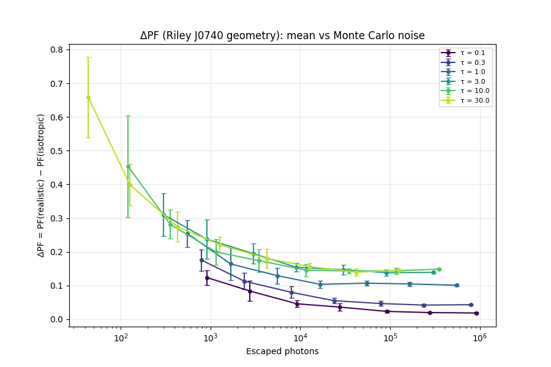

# Deep Dive — v0.9.7: The Convergence Redo — Sizing the Library in the Currency That Counts

> Companion to the [v0.9.7 progress-log entry](../../README.md#v097--the-convergence-redo-escaped-photons-are-the-currency).
> Supersedes the photon-count recommendation of [v0.7.0](v0.7.0-convergence-study.md) (which
> remains the reference for the method: seed-spread errors, the −1/2 law, knee/target logic).
> Grievance documented in [`next-steps.md §5`](../next-steps.md); resolved here.
> Code: `scripts/convergence_study_v2.py`. Raw records: `data/convergence_v2_results.npz`.
>
> **Builds on:** [v0.7.0](v0.7.0-convergence-study.md) (the original study),
> [v0.6.2](v0.6.2-reproducible-seeding.md) (the seeding this study's parallel streams extend),
> [v0.9.2](v0.9.2-j0740-anchor.md) (the J0740 ΔPF observable this study pushes convergence through).

---

## 1. What we initially thought (and why it was only partly right)

The beaming library (`scripts/tau_sweep.py`) runs **200,000 injected photons at every
τ ∈ {0.1, 0.3, 1, 3, 10, 30}**. We believed that number was backed by the v0.7.0 convergence
study. On inspection (2026-07-06, `next-steps.md §5`), the backing was much narrower than the
usage. Three specific beliefs turned out to be assumptions:

1. **"200k is the study-validated number."** Partly. 200k predates the study (it was a by-feel
   number the study blessed retroactively), and the study validated it for **one observable at
   one τ**: the bulk beaming-curve bins (μ ≈ 0.68) at τ = 10, to a 2% target. The library also
   ships the fitted limb-darkening slope `b(τ)` — for which the study's own table demanded
   ~8.2×10⁵ photons — and the low-μ tail bins (~1.5×10⁶, extrapolated). Both shipped at 200k.

2. **"One injected count buys the same quality at every τ."** No. The I(μ) histogram is built
   only from **escaped** photons, and the escape fraction falls from 92% (τ = 0.1) to 4.2%
   (τ = 30). A fixed 200k injected is 184k histogram entries at τ = 0.1 but only ~8,400 at
   τ = 30 — a **22× statistics disparity hidden inside a "uniform" setting**, worst exactly in
   the thick, near-Eddington regime the paper leans on.

3. **"b(τ) peaks at τ ≈ 10."** The stored library shows b rising to 1.794 at τ = 10 then
   *dropping* to 1.673 at τ = 30 — and `SHAPE_TAU = 10` in `anchor_lib.py` was justified as
   "where b(τ) peaks." Physically a thicker scattering slab cannot un-limb-darken, and the dip
   (0.12) was comparable to the measured seed scatter at that N (±0.1–0.26). We suspected noise,
   not physics. A fourth, related worry: the paper's headline ΔPF ≈ +0.16 carried **no error bar
   against library noise** — a referee's first question.

## 2. How we redid the convergence to address those thoughts

`scripts/convergence_study_v2.py` re-ran the error-vs-N measurement with three design changes,
each aimed at one of the beliefs above:

1. **Every library τ is swept, not just τ = 10.** N ∈ {10³ … 10⁶} at all six τ, plus an extra
   N = 3×10⁶ point at τ = 10 and 30 so the thick-row recommendation rests on measurement rather
   than extrapolation.

2. **Convergence is measured against *escaped* photons** — the real statistical currency. If
   error curves from different τ collapse onto one line when plotted against escaped count,
   then a single calibration converts to an injected budget per τ via the measured escape
   fractions.

3. **ΔPF joins the tracked observables.** Every (τ, N, seed) run's I(μ) is pushed through the
   actual anchor pipeline (Riley 2021 J0740 geometry, `multi_spot_flux`) — pure interpolation +
   geometry, so it costs nothing — measuring the Monte Carlo noise **in the currency of the
   paper's claim**. The mean should hold steady with N while the seed spread collapses; any
   drift of the mean is a bias, which error bars alone would never reveal.

Method upgrades along the way:

- **10 seeds for N ≤ 10⁵** (5 above). A 5-sample std is itself ~35% uncertain
  (relative error ≈ 1/√(2(n−1))), which is why the v0.7.0 error columns wobbled
  non-monotonically; 10 seeds cuts that to ~24% where it matters most.
- **Per-task RNG streams** via `SeedSequence(BASE_SEED, spawn_key=(τ×10, N, seed))` — every
  run reproducible in isolation, insensitive to grid edits and scheduling order (an
  improvement over v1's flat-index spawning, which shifted streams when the grid changed).
- **Process-parallel sweep**: runs are independent, so the 370 tasks (77.6M photons,
  ~2.3 CPU-hours) executed on 16 workers in **27.5 min wall** — no engine change, no
  vectorization, exactly as the v0.7.0 deferral intended.

## 3. The end result

### 3.1 Escaped photons are the universal currency

Every observable at every τ rides the N_esc^(−1/2) line (fitted log-log slopes −0.39 to −0.58),
and the per-τ curves **collapse onto each other** in escaped-photon coordinates — most cleanly
for the tail bin, which needs ~5–8×10⁴ escaped photons at *every* τ. The premise of the redo is
confirmed: quality is set by escaped count, and "uniform injected N" was never uniform quality.

### 3.2 The b(τ) dip is dead — it's a plateau

| τ | 0.1 | 0.3 | 1 | 3 | 10 | 30 |
|---|---|---|---|---|---|---|
| b, converged (this study) | 0.282±0.003 | 0.717±0.011 | 1.433±0.021 | 1.722±0.038 | 1.774±0.053 | **1.756±0.079** |
| b, current 200k library | 0.291 | 0.730 | 1.443 | 1.689 | 1.794 | **1.673** |

τ = 10 and τ = 30 are statistically identical: **b(τ) rises monotonically and saturates**, as
the physics demands. The library's dip was noise from the starved τ = 30 row, and the
"peak at τ ≈ 10" justification for `SHAPE_TAU` was resting on that noise. (τ = 10 remains a
fine choice — it sits *on* the plateau — but the comment must say plateau, not peak.)

### 3.3 ΔPF is emphatically not Monte Carlo noise — but it is biased at low N

Converged ΔPF (Riley J0740 geometry, largest N per τ):

| τ | 0.1 | 0.3 | 1 | 3 | 10 | 30 |
|---|---|---|---|---|---|---|
| ΔPF | +0.018 | +0.043 | +0.101 | +0.139 | **+0.1486±0.0026** | +0.145 |

A smooth saturation curve in τ, with the τ = 10 signal ~50σ above the converged seed scatter.
The wrong-beaming systematic survives full statistical scrutiny. Two honest wrinkles:

- **Low-N runs are biased high, not just noisy**: ΔPF converges *from above* (τ = 30: +0.66 at
  10³ photons → +0.145 converged). Noise in I(μ) inflates the flux extremes, and PF is built
  from max/min, so noise pumps PF — and ΔPF — up systematically. This is a bias, invisible to
  error bars, caught only because the study tracked the *mean* alongside the spread.
- **The headline number will move from +0.16 to ≈ +0.15.** The current library's +0.164
  (Riley) is a single 200k realization sitting ~1σ high of the converged +0.1486. Nothing was
  wrong — but the re-run library should land the paper's number near **+0.15**, now with a
  real error bar. Miller (+0.229) feeds off the same library rows and will shift
  proportionally when the anchors are re-run.

### 3.4 The production budget

Targets for a 5-seed pooled library (pooled = per-seed/√5): σ(b) ≤ 0.02, tail-bin σ ≤ 0.02,
σ(ΔPF) ≤ 0.01. The binding requirement across all τ and observables is ~3.4×10⁵ escaped
photons per seed (the b slope at thick τ; ΔPF itself is cheap at ~5×10³ — it integrates over
the whole curve). Recommendation, with margin and equal quality per row:

**Uniform 4×10⁵ escaped photons per (τ, seed), 5 seeds** — injected counts via the measured
escape fractions:

| τ | escape fraction | injected N per seed | × 5 seeds |
|---|---|---|---|
| 0.1 | 0.916 | 4.4×10⁵ | 2.2M |
| 0.3 | 0.793 | 5.0×10⁵ | 2.5M |
| 1.0 | 0.553 | 7.2×10⁵ | 3.6M |
| 3.0 | 0.302 | 1.3×10⁶ | 6.6M |
| 10 | 0.117 | 3.4×10⁶ | 17M |
| 30 | 0.042 | 9.5×10⁶ | 48M |

Total ≈ **80M injected photons** — the same size as this study's sweep, so ~30–90 min
wall-clock on the same 16-worker setup. Per row that is 43× (τ = 10) to 120× (τ = 30) the
current library's escaped statistics. Brute force at this cost also **demotes tail-bin
importance sampling from pre-paper work to a future-work sentence** — the 2% tail target is
met directly.

## 4. What we need to do moving forward

1. **Production library re-run** (rework `scripts/tau_sweep.py`): escape-matched injected N
   per the table above; per-(τ, seed) `SeedSequence` streams (replacing the single sequential
   RNG, which silently couples the τ rows); store the pooled I(μ; τ) **plus per-bin seed std
   and b ± σ** in `beaming_library.npz`.
2. **Re-run everything downstream** — J0030 and J0740 anchors, phase diagram, finite-cap — all
   pure interpolation + geometry, seconds each. Run the anchors once per seed-library to quote
   **ΔPF ± σ** for both Riley and Miller. Expect the headline to settle near +0.15 (Riley).
3. **Reword `SHAPE_TAU = 10`** in `anchor_lib.py` (and the Rung-C narrative): "on the
   saturated b(τ) plateau," not "where b(τ) peaks."
4. **Methods paragraph for the paper:** escaped-photon currency, escape-matched budgets,
   seed-based error bars, the low-N ΔPF bias and why production N clears it, tail-bin target
   met by brute force with importance sampling as future work.
5. **Propagate the new numbers** through README/docs where +0.16/+0.23 appear, once the
   production library lands (single source: the re-run anchor outputs).

## 5. Validation and status

- **Cross-check against v0.7.0:** at τ = 10 the new sweep reproduces the old study where they
  overlap (b = 1.765±0.045 at N = 10⁶ vs v1's 1.75±0.08); the v1 script and its cached
  `data/convergence_results.npz` are retained untouched as the baseline.
- **Undersampled corners handled honestly:** runs whose normalization bin is empty record NaN
  (masked from fits) rather than a garbage curve — the v1 lesson, kept.
- **No engine change:** `mcrt` core untouched; parallelism is process-level over independent
  (τ, N, seed) tasks with per-task streams.

---

## Quick reference card

| Concept | Where | One-line summary |
|---|---|---|
| Statistical currency | §3.1 | error is set by **escaped** photons; curves collapse across τ |
| Escape fractions | §3.4 | 0.92 → 0.042 from τ = 0.1 to 30 (fixed injected N ≠ fixed quality) |
| b(τ) shape | §3.2 | monotonic rise to a **plateau** (~1.76–1.77); the τ = 30 dip was noise |
| ΔPF convergence | §3.3 | +0.1486 ± 0.0026 at τ = 10 (Riley); biased high at low N, converges from above |
| Headline impact | §3.3 | paper's +0.16 → ≈ +0.15 expected after the production re-run |
| Production budget | §3.4 | 4×10⁵ escaped per (τ, seed) × 5 seeds ≈ 80M injected total |
| Next | §4 | escape-matched `tau_sweep`, ΔPF ± σ through the anchors, reword `SHAPE_TAU` |
