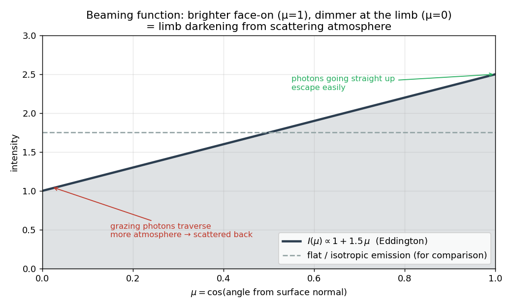

# Deep Dive — Week 5: Validation & the Beaming Function

> Companion to the [Week 5 progress-log entry](../../README.md#week-5--the-engine-is-physically-validated).
> Covers how the simulation output is turned into a beaming function, why it matches classical
> theory, and how that connects to NICER. Validation code lives in `scripts/validate_engine.py`.
>
> **Builds on:** [Weeks 3–4: Photon Transport](weeks-3-4-photon-transport.md) (the escape angles
> come from the random walk).
>
> Figures are generated by [`make_figures.py`](make_figures.py).

---

## 1. The beaming function and limb darkening

For each escaped photon we record `μ = cos(exit angle from the vertical)`. Histogramming all those μ values gives the **beaming function** `I(μ)`.

In the limit of a semi-infinite scattering atmosphere, classical radiative transfer (the Eddington approximation) predicts:

$$ I(\mu) \propto 1 + \tfrac{3}{2}\,\mu $$

Why does this shape make physical sense?

- A photon trying to escape at μ ≈ 0 (grazing the surface) has to traverse a lot of atmosphere → many chances to be scattered back down → dimmer.
- A photon escaping at μ ≈ 1 (straight up) crosses the minimum amount of atmosphere → brightest.

So the surface looks **darker at the limb** and **brighter face-on**. This is "limb darkening" — the same effect that makes the edge of the Sun look dimmer than the center.

`validate_engine.plot_beaming_function` does exactly this: bin all escape angles, overlay `1 + 1.5μ`, and check that the Monte Carlo result matches the analytical curve. **That match is the Week-5 validation gate.**

### The two supporting checks

Alongside the beaming-function comparison, two bookkeeping checks confirm the engine is sound:

- **Energy / photon conservation.** Every injected photon ends as *escaped* or *absorbed* — never lost or duplicated. The validator asserts `escaped + absorbed == injected` exactly.
- **Mean free path.** Total path length ÷ total scatters ≈ **1.0** optical depth, confirming the `−ln(U)` step sampling from [Weeks 1–2](weeks-1-2-sampling-primitives.md) behaves correctly in the assembled engine.

---

## 2. How this connects to NICER

NICER measures the X-ray brightness of a rotating neutron star vs time. The hot spot on the surface moves in and out of view as the star spins, and the angle between the spot's normal and your line of sight changes continuously.

If you assume isotropic emission, the pulse profile depends only on geometry. If you instead use the *real* `I(μ)` from this simulation, the profile changes — the pulse shape, peak-to-trough contrast, and "pulsed fraction" all shift.

That difference is the scientific output of the project. Everything in these deep dives is the foundation that makes that comparison meaningful.

---

## Quick reference card

| Concept | Code | One-line summary |
|---|---|---|
| Beaming function | `plot_beaming_function` | histogram of exit μ; should match `1 + 1.5μ` |
| Energy conservation | `validate_energy_conservation` | escaped + absorbed = injected |
| Mean free path | `validate_mean_free_path` | Σpath / Σscatters ≈ 1.0 |

**Next:** extract beaming functions across a range of `tau_total` values (Weeks 6–7) — a new
deep dive will accompany that progress-log entry.
