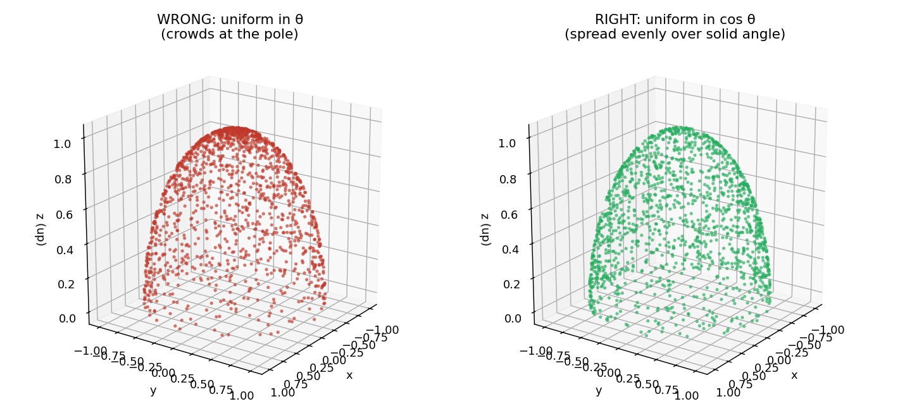
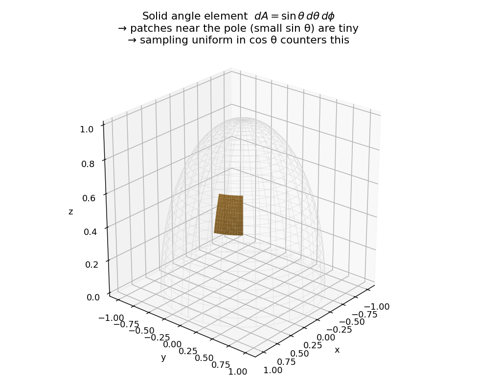

# Deep Dive — Weeks 3–4: Photon Transport

> Companion to the [Weeks 3–4 progress-log entry](../../README.md#weeks-34--photons-travel-through-the-atmosphere-end-to-end).
> Covers the math behind `src/mcrt/monte_carlo.py`: how a photon is injected, and how the full
> random walk is assembled.
>
> **Builds on:** [Weeks 1–2: Sampling Primitives](weeks-1-2-sampling-primitives.md) (step size,
> Thomson phase, rotation). **Leads to:** [Week 5: Validation](week-5-validation.md).
>
> Figures are generated by [`make_figures.py`](make_figures.py).

---

## 1. Hemispherical injection: why uniform in **cos θ**, not in θ?

At the bottom of the atmosphere, hot gas emits photons in **all upward directions equally** — this is what "isotropic" means in radiative transfer. "Isotropic" means *equal flux per unit solid angle*, not "uniformly across all angles you can name."

**The trap.** If you pick θ uniformly in `[0, π/2]` and φ uniformly in `[0, 2π]`, your photons will pile up at the pole (straight up). That's wrong.

**Why.** A patch on a sphere at angle θ has area `dA = sin θ dθ dφ`. Near the pole (θ ≈ 0), `sin θ` is tiny, so each `dθ` corresponds to almost no real area. Near the equator (θ ≈ π/2), `sin θ ≈ 1`, so each `dθ` is a fat ring of area. To get an even spread, you need to weight by `sin θ`.

**The clean fix.** Sample `cos θ` uniformly. Then `d(cos θ) = −sin θ dθ`, which exactly cancels the `sin θ` in the area element. Uniform in cos θ ↔ uniform over solid angle.



*Left, the naive method clusters points at the pole. Right, the code's method (`costheta = U(0,1)`, `sintheta = √(1−cos²θ)`) spreads them evenly over the hemisphere.*



*The orange patch shows a chunk of solid angle `sin θ dθ dφ`. Patches at different latitudes look different sizes for the same `(dθ, dφ)`. That `sin θ` factor is why we sample uniform in cos θ.*

In `monte_carlo.py` the line `costheta = np.random.uniform(0, 1)` is the entire trick. The `0` to `1` (instead of `−1` to `1`) is what makes it a **hemisphere** (upper half) instead of a full sphere.

---

## 2. The random walk in pictures

Putting it all together — with the primitives from [Weeks 1–2](weeks-1-2-sampling-primitives.md) — one photon does:

```
inject at bottom with random upward direction
repeat:
    step = -ln(U)                  # distance to next event
    move along current direction
    if reached top:  escape, record exit angle
    if reached bottom: absorbed, count it
    else:
        μ = sample Thomson           # scatter angle
        v = rotate_vector(v, μ)      # new direction
```

The behavior depends entirely on `tau_total`:


*From left to right: optically thin (τ=0.5), moderate (τ=2), and thick (τ=10) atmospheres. In thin slabs most photons escape in a roughly straight line. In thick slabs they bounce many times — and many get re-absorbed back into the surface (red).*

**Boundaries.** A photon that reaches τ ≤ 0 escapes (we record its exit μ). A photon that drifts back down to τ ≥ τ_total is absorbed — "lost to the thermal source." Every photon ends in exactly one of these two states, which is the basis for the energy-conservation check in the next deep dive.

---

## Quick reference card

| Concept | Code | One-line summary |
|---|---|---|
| Hemispherical injection | `monte_carlo.py` | uniform in cos θ ⇒ uniform over solid angle |
| The walk | `Simulation.run` | step → move → escape/absorb/scatter, repeat |

**Next:** we histogram the escape angles and check the result against analytic theory in
[Week 5: Validation](week-5-validation.md).
